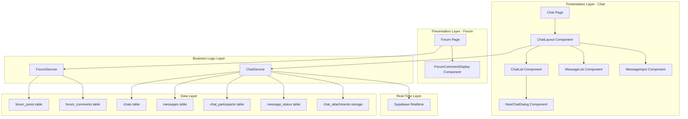

# Design Document: Access Interaction

## Overview

The Access Interaction feature provides two communication channels on the SignBridge platform: a community forum for public discussions and personal chat for private messaging. The forum supports threaded discussions with nested comments, while the chat provides real-time one-on-one messaging with file attachment support. Both features are **fully implemented** in the codebase with comprehensive UI components and service layers.

**Key Design Principle**: This spec documents the existing, fully functional implementation of UC11.

## Architecture

### System Components



### Data Flow

**Forum Post Creation Flow:**
1. User clicks "Add New Post"
2. System displays post creation dialog
3. User enters title and content
4. User clicks submit
5. ForumService.createPost() called
6. Service creates forum_posts record
7. Post added to local state
8. UI updates to show new post
9. Toast notification confirms success

**Forum Comment Flow:**
1. User clicks "View Comments" on post
2. System fetches comments via ForumService.getCommentsByPostId()
3. Comments organized into hierarchical structure
4. User adds comment or reply
5. ForumService.createComment() called with parent_comment_id
6. Comment added to nested structure
7. UI updates to show new comment
8. Toast notification confirms success

**Chat Message Flow:**
1. User selects chat from list
2. ChatService.getMessages() fetches message history
3. ChatService.subscribeToMessages() establishes real-time connection
4. User types and sends message
5. ChatService.sendMessage() creates message record
6. Message added to local state
7. Real-time subscription delivers message to recipient
8. Recipient's UI updates automatically
9. ChatService.markMessagesAsRead() updates read status

## Components and Interfaces

### 1. Forum Page Component (Existing)

**Location**: `src/app/(main)/interaction/forum/page.tsx`

**Responsibilities:**
- Display list of forum posts
- Handle post creation, editing, and deletion
- Manage comment display and interactions
- Handle authentication checks

**State Management:**
```typescript
interface ForumPageState {
  posts: ForumPost[];
  newTitle: string;
  newContent: string;
  selectedPostIdForComment: string | null;
  topLevelCommentText: string;
  postComments: Record<string, ForumComment[]>;
  isLoading: boolean;
  isSubmittingPost: boolean;
  isSubmittingComment: boolean;
  showCreateFormModal: boolean;
  editingPost: ForumPost | null;
}
```

**Key Methods:**
- `handlePostSubmit()` - Create or update post
- `handleEditPostClick()` - Open edit dialog
- `handleDeletePost()` - Delete post with confirmation
- `handleAddComment()` - Add top-level or nested comment
- `handleDeleteComment()` - Delete comment recursively
- `handleEditComment()` - Update comment text

**Current Implementation**: ✅ Complete
- Full CRUD for posts
- Nested comment support
- Edit/delete with ownership validation
- Loading and error states
- Toast notifications

### 2. ForumCommentDisplay Component (Existing)

**Location**: `src/app/(main)/interaction/forum/page.tsx` (inline component)

**Responsibilities:**
- Render individual comments recursively
- Handle reply input
- Handle comment editing
- Handle comment deletion
- Display nested replies with indentation

**Props:**
```typescript
interface ForumCommentDisplayProps {
  comment: ForumComment;
  onReply: (parentCommentId: string, replyText: string) => void;
  onDelete: (commentId: string) => void;
  onEdit: (commentId: string, newText: string) => void;
  currentUserId: string | undefined;
}
```

**Features:**
- Recursive rendering for nested comments
- Inline edit mode
- Reply input toggle
- Ownership-based action visibility
- Loading states for async operations

**Current Implementation**: ✅ Complete

### 3. Chat Page Component (Existing)

**Location**: `src/app/(main)/interaction/chat/page.tsx`

**Responsibilities:**
- Render ChatLayout with Suspense
- Handle loading state

**Current Implementation**: ✅ Complete

### 4. ChatLayout Component (Existing)

**Location**: `src/components/chat/ChatLayout.tsx`

**Responsibilities:**
- Coordinate chat functionality
- Manage chat list and message display
- Handle chat selection
- Subscribe to real-time updates
- Mark messages as read

**State Management:**
```typescript
interface ChatLayoutState {
  chats: Chat[];
  selectedChat: Chat | null;
  messages: Message[];
  isLoadingChats: boolean;
  isLoadingMessages: boolean;
}
```

**Key Methods:**
- `loadChats()` - Fetch user's chats
- `loadMessages()` - Fetch messages for selected chat
- `subscribeToMessages()` - Set up real-time subscription
- `markMessagesAsRead()` - Update read status
- `handleSendMessage()` - Send text message
- `handleSendFile()` - Upload and send file
- `handleCreateChat()` - Create new chat

**Current Implementation**: ✅ Complete
- Real-time message delivery
- File upload support
- Read status tracking
- Responsive layout
- Loading states

### 5. ChatList Component (Existing)

**Location**: `src/components/chat/ChatList.tsx`

**Responsibilities:**
- Display list of chats
- Show chat names and timestamps
- Handle chat selection
- Provide new chat button
- Show loading skeleton

**Props:**
```typescript
interface ChatListProps {
  chats: Chat[];
  isLoading: boolean;
  selectedChat: Chat | null;
  onSelectChat: (chat: Chat) => void;
  onCreateChat: (userId: string) => Promise<void> | void;
  currentUserId: string;
}
```

**Features:**
- Avatar with initials
- Last message time display
- Active chat highlighting
- Empty state message
- Loading skeleton

**Current Implementation**: ✅ Complete

### 6. MessageList Component (Existing)

**Location**: `src/components/chat/MessageList.tsx`

**Responsibilities:**
- Display messages in chronological order
- Group messages by date
- Show sender information
- Display file attachments
- Handle scrolling

**Props:**
```typescript
interface MessageListProps {
  messages: Message[];
  isLoading: boolean;
  currentUserId: string;
}
```

**Features:**
- Date separators
- Sender/receiver visual distinction
- File attachment links
- Edit indicators
- Timestamp display
- Empty state

**Current Implementation**: ✅ Complete

### 7. MessageInput Component (Existing)

**Location**: `src/components/chat/MessageInput.tsx`

**Responsibilities:**
- Provide message input field
- Handle message submission
- Handle file attachment
- Show loading state

**Props:**
```typescript
interface MessageInputProps {
  onSendMessage: (content: string) => Promise<void>;
  onSendFile: (file: File) => Promise<void>;
  disabled?: boolean;
}
```

**Features:**
- Text input with submit
- File attachment button
- Loading indicators
- Disabled state
- Error handling

**Current Implementation**: ✅ Complete

### 8. NewChatDialog Component (Existing)

**Location**: `src/components/chat/NewChatDialog.tsx`

**Responsibilities:**
- Provide user search interface
- Display search results
- Handle chat creation

**Props:**
```typescript
interface NewChatDialogProps {
  onCreateChat: (userId: string) => Promise<void> | void;
  currentUserId: string;
}
```

**Features:**
- Debounced search
- User profile display
- Avatar with initials
- Loading state
- Empty state

**Current Implementation**: ✅ Complete

### 9. ForumService (Existing)

**Location**: `src/lib/services/forumService.ts`

**Methods:**
```typescript
class ForumService {
  // Posts
  static async getPosts(): Promise<ForumPost[]>;
  static async getPostById(id: string): Promise<ForumPost | null>;
  static async createPost(post: {
    title: string;
    content: string;
  }): Promise<ForumPost>;
  static async updatePost(id: string, updates: {
    title?: string;
    content?: string;
  }): Promise<ForumPost>;
  static async deletePost(id: string): Promise<void>;
  
  // Comments
  static async getCommentsByPostId(postId: string): Promise<ForumComment[]>;
  static async createComment(comment: {
    post_id: string;
    content: string;
    parent_comment_id?: string | null;
  }): Promise<ForumComment>;
  static async updateComment(id: string, content: string): Promise<ForumComment>;
  static async deleteComment(id: string): Promise<void>;
}
```

**Features:**
- Hierarchical comment organization
- User profile joins
- Cascade delete for posts
- Authentication integration

**Current Implementation**: ✅ Complete

### 10. ChatService (Existing)

**Location**: `src/lib/services/chatService.ts`

**Methods:**
```typescript
class ChatService {
  static async getUserProfile(userId: string): Promise<{
    data: UserProfile | null;
    error: any;
  }>;
  static async getChats(): Promise<Chat[]>;
  static async getMessages(chatId: string): Promise<Message[]>;
  static async sendMessage(params: {
    chat_id: string;
    sender_id: string;
    content: string;
    file_url?: string;
  }): Promise<Message>;
  static async markMessagesAsRead(params: {
    messages: Message[];
    userId: string;
  }): Promise<void>;
  static async uploadFile(file: File, userId: string): Promise<string>;
  static subscribeToMessages(
    chatId: string,
    callback: (payload: RealtimePostgresChangesPayload) => void
  ): RealtimeChannel;
  static async createChat(params: {
    user_ids: string[];
    is_group: boolean;
  }): Promise<Chat>;
  static async updateLastMessageTime(chatId: string): Promise<void>;
}
```

**Features:**
- Real-time subscriptions via Supabase
- File upload to storage
- Read status tracking
- Chat creation with RPC function

**Current Implementation**: ✅ Complete

## Data Models

### Forum Data Models

```typescript
interface ForumPost {
  id: string;
  title: string;
  content: string;
  user_id: string;
  created_at: string;
  updated_at: string;
  user_profile?: {
    username: string;
    avatar_url?: string;
  };
}

interface ForumComment {
  id: string;
  post_id: string;
  content: string;
  user_id: string;
  parent_comment_id: string | null;
  created_at: string;
  updated_at: string;
  user_profile?: {
    username: string;
    avatar_url?: string;
  };
  replies?: ForumComment[];
}
```

### Chat Data Models

```typescript
interface Chat {
  id: string;
  is_group: boolean;
  last_message_at: string;
  participants: {
    user_id: string;
    user: {
      name: string;
    };
  }[];
}

interface Message {
  id: string;
  content: string;
  sender_id: string;
  file_url?: string;
  created_at: string;
  is_edited: boolean;
  reply_to_id?: string;
  sender: {
    name: string;
  };
}

interface UserProfile {
  id: string;
  name: string;
}
```

### Database Schema

**forum_posts table:**
- `id` (UUID, PRIMARY KEY)
- `title` (VARCHAR, NOT NULL)
- `content` (TEXT, NOT NULL)
- `user_id` (UUID, FOREIGN KEY → user_profiles.id)
- `created_at` (TIMESTAMP)
- `updated_at` (TIMESTAMP)

**forum_comments table:**
- `id` (UUID, PRIMARY KEY)
- `post_id` (UUID, FOREIGN KEY → forum_posts.id)
- `content` (TEXT, NOT NULL)
- `user_id` (UUID, FOREIGN KEY → user_profiles.id)
- `parent_comment_id` (UUID, FOREIGN KEY → forum_comments.id, NULL)
- `created_at` (TIMESTAMP)
- `updated_at` (TIMESTAMP)

**chats table:**
- `id` (UUID, PRIMARY KEY)
- `is_group` (BOOLEAN)
- `last_message_at` (TIMESTAMP)
- `created_at` (TIMESTAMP)

**messages table:**
- `id` (UUID, PRIMARY KEY)
- `chat_id` (UUID, FOREIGN KEY → chats.id)
- `sender_id` (UUID, FOREIGN KEY → user_profiles.id)
- `content` (TEXT, NOT NULL)
- `file_url` (VARCHAR, NULL)
- `is_edited` (BOOLEAN, DEFAULT FALSE)
- `reply_to_id` (UUID, FOREIGN KEY → messages.id, NULL)
- `created_at` (TIMESTAMP)

**chat_participants table:**
- `id` (UUID, PRIMARY KEY)
- `chat_id` (UUID, FOREIGN KEY → chats.id)
- `user_id` (UUID, FOREIGN KEY → user_profiles.id)
- `joined_at` (TIMESTAMP)

**message_status table:**
- `message_id` (UUID, FOREIGN KEY → messages.id)
- `user_id` (UUID, FOREIGN KEY → user_profiles.id)
- `is_read` (BOOLEAN, DEFAULT FALSE)
- `read_at` (TIMESTAMP, NULL)
- PRIMARY KEY (message_id, user_id)

**chat_attachments storage bucket:**
- Stores uploaded files
- Path format: `{user_id}/{timestamp}.{extension}`

## Real-Time Implementation

### Supabase Realtime

The chat feature uses Supabase Realtime for instant message delivery:

```typescript
const channel = supabase
  .channel(`chat:${chatId}`)
  .on(
    'postgres_changes',
    {
      event: 'INSERT',
      schema: 'public',
      table: 'messages',
      filter: `chat_id=eq.${chatId}`,
    },
    (payload) => {
      // Handle new message
      const newMessage = payload.new as Message;
      // Fetch sender profile and update UI
    }
  )
  .subscribe();
```

**Features:**
- WebSocket-based connection
- Automatic reconnection
- Filtered by chat_id
- Triggers on INSERT events
- Unsubscribe on component unmount

## Recursive Comment Handling

### Helper Functions

**Add Reply to Comment:**
```typescript
const addReplyToComment = (
  comments: ForumComment[],
  parentCommentId: string,
  newComment: ForumComment
): ForumComment[] => {
  return comments.map(comment => {
    if (comment.id === parentCommentId) {
      return {
        ...comment,
        replies: [...(comment.replies || []), newComment]
      };
    } else if (comment.replies && comment.replies.length > 0) {
      return {
        ...comment,
        replies: addReplyToComment(comment.replies, parentCommentId, newComment)
      };
    }
    return comment;
  });
};
```

**Remove Comment Recursively:**
```typescript
const removeCommentRecursive = (
  comments: ForumComment[],
  commentIdToDelete: string
): ForumComment[] => {
  const updatedComments = [];
  for (const comment of comments) {
    if (comment.id === commentIdToDelete) {
      continue; // Skip deleted comment
    }
    if (comment.replies && comment.replies.length > 0) {
      const updatedReplies = removeCommentRecursive(comment.replies, commentIdToDelete);
      updatedComments.push({ ...comment, replies: updatedReplies });
    } else {
      updatedComments.push(comment);
    }
  }
  return updatedComments;
};
```

**Update Comment Recursively:**
```typescript
const updateCommentRecursive = (
  comments: ForumComment[],
  commentIdToEdit: string,
  newText: string
): ForumComment[] => {
  return comments.map(comment => {
    if (comment.id === commentIdToEdit) {
      return { ...comment, content: newText };
    } else if (comment.replies && comment.replies.length > 0) {
      return {
        ...comment,
        replies: updateCommentRecursive(comment.replies, commentIdToEdit, newText)
      };
    }
    return comment;
  });
};
```

## Error Handling

### Forum Error Handling

**Post/Comment Creation Errors:**
- Validate required fields
- Check authentication
- Display toast on error
- Preserve form data
- Log errors for debugging

**Delete Confirmation:**
- Show confirmation dialog
- Warn about cascade delete for posts
- Display success/error toast

**Current Implementation**: ✅ Complete

### Chat Error Handling

**Message Send Errors:**
- Display error toast
- Preserve message text
- Allow retry
- Log error details

**File Upload Errors:**
- Validate file type and size
- Display specific error messages
- Clear file input on error
- Show upload progress

**Real-Time Connection Errors:**
- Automatic reconnection via Supabase
- Graceful degradation
- Error logging

**Current Implementation**: ✅ Complete

## Security Considerations

### Authentication & Authorization

- Verify user authentication before operations
- Validate ownership for edit/delete actions
- Use Supabase RLS policies
- Server-side validation

**Current Implementation**: ✅ Complete

### Input Validation

- Sanitize text inputs
- Validate file types and sizes
- Prevent SQL injection via parameterized queries
- Prevent XSS through proper encoding

**Current Implementation**: ✅ Complete

### File Upload Security

- Validate file types
- Enforce size limits
- Sanitize filenames
- Store in isolated bucket
- Generate unique paths

**Current Implementation**: ✅ Complete

## Performance Considerations

### Forum Performance

- Paginate posts (future enhancement)
- Lazy load comments
- Optimize recursive operations
- Cache user profiles

### Chat Performance

- Paginate message history (future enhancement)
- Efficient real-time subscriptions
- Optimize file uploads
- Connection pooling

### Database Optimization

- Index foreign keys
- Optimize comment hierarchy queries
- Use database functions for chat creation

**Current Implementation**: ✅ Mostly complete (pagination can be added later)

## Responsive Design

### Mobile Adaptations

**Forum:**
- Responsive card layout
- Touch-friendly buttons
- Collapsible comment sections

**Chat:**
- Full-screen chat list on mobile
- Hide chat list when chat selected
- Back button to return to list
- Side-by-side layout on desktop

**Current Implementation**: ✅ Complete

## Testing Strategy

### Unit Tests

**Service Methods:**
- Test CRUD operations
- Test recursive comment functions
- Mock Supabase client

**Helper Functions:**
- Test comment tree manipulation
- Test edge cases

### Component Tests

**Forum Components:**
- Test post rendering
- Test comment nesting
- Test edit/delete actions

**Chat Components:**
- Test message display
- Test real-time updates
- Test file upload

### Integration Tests

**Forum Flow:**
- Test post creation to display
- Test comment threading
- Test edit/delete persistence

**Chat Flow:**
- Test message send/receive
- Test real-time delivery
- Test file upload/download

### E2E Tests

**Forum Journey:**
1. Create post
2. Add comments
3. Reply to comments
4. Edit post/comments
5. Delete post

**Chat Journey:**
1. Start new chat
2. Send messages
3. Upload file
4. Receive real-time messages
5. Mark as read

## Summary

The Access Interaction feature is **fully implemented** in the codebase with:

✅ **Forum Features**
- Post CRUD operations
- Nested comment threading
- Edit/delete with ownership validation
- Recursive comment handling
- User profile integration

✅ **Chat Features**
- Real-time messaging via Supabase Realtime
- File attachment support
- Read status tracking
- User search and chat creation
- Responsive mobile/desktop layout

✅ **Service Layer**
- ForumService with complete CRUD
- ChatService with real-time subscriptions
- File upload to Supabase Storage

✅ **UI Components**
- Comprehensive forum page
- Modular chat components
- Loading and error states
- Toast notifications

The implementation follows React best practices, uses TypeScript for type safety, and integrates seamlessly with Supabase for data persistence and real-time functionality.

