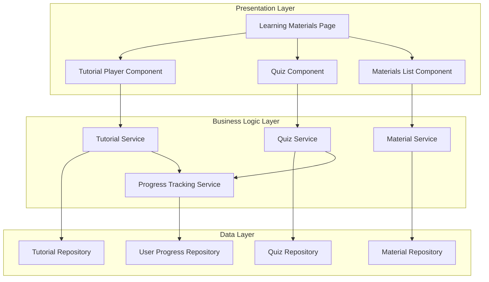

# Design Document: Browse Education Materials

## Overview

The Browse Education Materials feature provides users with access to structured learning content including video tutorials, interactive quizzes, and downloadable resources. The system tracks user interactions with these materials to support progress monitoring and personalized learning paths. This feature integrates with the user progress tracking system (UC10) to provide a comprehensive view of learning advancement.

The design follows a modular architecture with separate components for tutorials, quizzes, and downloadable materials, each with dedicated services and repositories. The system maintains user-specific progress data and supports flexible navigation allowing users to engage with content in any order.

## Architecture

### System Components



### Data Flow

**Tutorial Viewing Flow:**
1. User navigates to Learning Materials section
2. System fetches tutorials with user's progress status
3. User clicks play on a tutorial
4. System displays tutorial video and current status
5. User optionally marks tutorial as complete
6. System updates tutorial status in database
7. Progress tracking service updates overall progress

**Quiz Taking Flow:**
1. User navigates to quiz section
2. System fetches quizzes with user's attempt history
3. User starts a quiz
4. System displays questions one by one
5. User submits answers
6. System calculates score and displays results
7. System saves quiz result to database
8. Progress tracking service updates overall progress

**Material Download Flow:**
1. User navigates to materials section
2. System fetches available materials
3. User clicks download button
4. System retrieves file from storage
5. System initiates browser download

## Components and Interfaces

### 1. Learning Materials Page Component

**Responsibilities:**
- Render tabbed interface for tutorials, quizzes, and materials
- Coordinate navigation between sections
- Display section-specific content

**State Management:**
```typescript
interface LearningMaterialsState {
  activeTab: 'tutorials' | 'quizzes' | 'materials';
  isLoading: boolean;
}
```

**Key Methods:**
- `switchTab(tab: string)`: Change active section
- `loadContent()`: Fetch content for active tab

### 2. Tutorial Player Component

**Responsibilities:**
- Display tutorial video
- Show tutorial metadata (title, description, level)
- Display current completion status
- Provide controls to update completion status
- Handle video playback

**Props:**
```typescript
interface TutorialPlayerProps {
  tutorialId: string;
  onStatusChange: (status: TutorialStatus) => void;
}

interface TutorialData {
  id: string;
  title: string;
  description: string;
  videoUrl: string;
  level: 'beginner' | 'intermediate' | 'advanced';
  userStatus: 'not_started' | 'in_progress' | 'completed';
}
```

**Key Methods:**
- `loadTutorial(id: string)`: Fetch tutorial data
- `updateStatus(status: string)`: Update completion status
- `handleVideoPlay()`: Mark tutorial as in progress
- `markComplete()`: Mark tutorial as completed

### 3. Tutorial List Component

**Responsibilities:**
- Display list of available tutorials
- Show completion status for each tutorial
- Filter tutorials by level
- Provide play button for each tutorial

**State Management:**
```typescript
interface TutorialListState {
  tutorials: TutorialListItem[];
  levelFilter: 'all' | 'beginner' | 'intermediate' | 'advanced';
  isLoading: boolean;
}

interface TutorialListItem {
  id: string;
  title: string;
  description: string;
  thumbnailUrl: string;
  level: string;
  duration: number;
  userStatus: 'not_started' | 'in_progress' | 'completed';
}
```

### 4. Quiz Component

**Responsibilities:**
- Display quiz questions
- Handle answer selection
- Submit quiz and display results
- Show previous quiz attempts and scores

**State Management:**
```typescript
interface QuizState {
  quizId: string;
  questions: QuizQuestion[];
  currentQuestionIndex: number;
  userAnswers: Map<string, string>;
  isSubmitted: boolean;
  result: QuizResult | null;
  previousAttempts: QuizAttempt[];
}

interface QuizQuestion {
  id: string;
  questionText: string;
  options: QuizOption[];
  correctAnswer: string;
  explanation: string;
}

interface QuizOption {
  id: string;
  text: string;
}

interface QuizResult {
  score: number;
  totalQuestions: number;
  percentage: number;
  correctAnswers: number;
  incorrectAnswers: number;
}

interface QuizAttempt {
  attemptDate: Date;
  score: number;
  percentage: number;
}
```

**Key Methods:**
- `loadQuiz(id: string)`: Fetch quiz questions
- `selectAnswer(questionId: string, answerId: string)`: Record user answer
- `submitQuiz()`: Calculate and save results
- `nextQuestion()`: Navigate to next question
- `previousQuestion()`: Navigate to previous question

### 5. Materials List Component

**Responsibilities:**
- Display list of downloadable materials
- Show material metadata (title, description, file type, size)
- Provide download functionality
- Filter materials by level or category

**State Management:**
```typescript
interface MaterialsListState {
  materials: MaterialItem[];
  levelFilter: 'all' | 'beginner' | 'intermediate' | 'advanced';
  isLoading: boolean;
}

interface MaterialItem {
  id: string;
  title: string;
  description: string;
  fileUrl: string;
  fileType: string;
  fileSize: number;
  level: string;
  category: string;
}
```

**Key Methods:**
- `loadMaterials()`: Fetch materials list
- `downloadMaterial(id: string)`: Initiate download
- `filterByLevel(level: string)`: Apply level filter

### 6. Tutorial Service

**Responsibilities:**
- Fetch tutorials with user progress
- Update tutorial completion status
- Coordinate with progress tracking service

**Interface:**
```typescript
interface TutorialService {
  getTutorials(userId: string, level?: string): Promise<TutorialListItem[]>;
  getTutorialById(tutorialId: string, userId: string): Promise<TutorialData>;
  updateTutorialStatus(userId: string, tutorialId: string, status: TutorialStatus): Promise<void>;
}

type TutorialStatus = 'not_started' | 'in_progress' | 'completed';
```

### 7. Quiz Service

**Responsibilities:**
- Fetch quizzes and questions
- Submit quiz answers and calculate score
- Retrieve quiz attempt history
- Coordinate with progress tracking service

**Interface:**
```typescript
interface QuizService {
  getQuizzes(userId: string): Promise<QuizListItem[]>;
  getQuizById(quizId: string): Promise<Quiz>;
  submitQuiz(userId: string, quizId: string, answers: Map<string, string>): Promise<QuizResult>;
  getQuizAttempts(userId: string, quizId: string): Promise<QuizAttempt[]>;
}

interface Quiz {
  id: string;
  title: string;
  description: string;
  questions: QuizQuestion[];
  level: string;
}

interface QuizListItem {
  id: string;
  title: string;
  description: string;
  level: string;
  questionCount: number;
  bestScore: number | null;
  attemptCount: number;
}
```

### 8. Material Service

**Responsibilities:**
- Fetch downloadable materials
- Generate download URLs
- Track download events (optional)

**Interface:**
```typescript
interface MaterialService {
  getMaterials(level?: string): Promise<MaterialItem[]>;
  getMaterialById(id: string): Promise<MaterialItem>;
  getDownloadUrl(materialId: string): Promise<string>;
}
```

### 9. Progress Tracking Service

**Responsibilities:**
- Update user progress when tutorials are completed
- Update user progress when quizzes are taken
- Calculate overall progress metrics
- Provide data for dashboard display (UC10)

**Interface:**
```typescript
interface ProgressTrackingService {
  updateTutorialProgress(userId: string, tutorialId: string, status: TutorialStatus): Promise<void>;
  updateQuizProgress(userId: string, quizId: string, score: number): Promise<void>;
  getUserProgress(userId: string): Promise<UserProgress>;
}

interface UserProgress {
  tutorialsStarted: number;
  tutorialsInProgress: number;
  tutorialsCompleted: number;
  tutorialCompletionPercentage: number;
  quizzesAttempted: number;
  quizCompletionPercentage: number;
  averageQuizScore: number;
}
```

### 10. Tutorial Repository

**Responsibilities:**
- CRUD operations for tutorials
- Query tutorials by level
- Join with user progress data

**Interface:**
```typescript
interface TutorialRepository {
  findAll(): Promise<Tutorial[]>;
  findById(id: string): Promise<Tutorial | null>;
  findByLevel(level: string): Promise<Tutorial[]>;
  findWithUserProgress(userId: string): Promise<TutorialWithProgress[]>;
}

interface Tutorial {
  id: string;
  title: string;
  description: string;
  videoUrl: string;
  thumbnailUrl: string;
  level: string;
  duration: number;
  createdAt: Date;
}

interface TutorialWithProgress extends Tutorial {
  userStatus: TutorialStatus;
}
```

### 11. Quiz Repository

**Responsibilities:**
- CRUD operations for quizzes and questions
- Query quizzes with user attempt history
- Store quiz results

**Interface:**
```typescript
interface QuizRepository {
  findAll(): Promise<Quiz[]>;
  findById(id: string): Promise<Quiz | null>;
  findWithUserAttempts(userId: string): Promise<QuizWithAttempts[]>;
  saveQuizResult(result: QuizResultRecord): Promise<void>;
  findUserAttempts(userId: string, quizId: string): Promise<QuizAttempt[]>;
}

interface QuizWithAttempts extends Quiz {
  bestScore: number | null;
  attemptCount: number;
}

interface QuizResultRecord {
  userId: string;
  quizId: string;
  score: number;
  totalQuestions: number;
  percentage: number;
  answers: QuizAnswerRecord[];
  attemptDate: Date;
}

interface QuizAnswerRecord {
  questionId: string;
  selectedAnswer: string;
  isCorrect: boolean;
}
```

### 12. Material Repository

**Responsibilities:**
- CRUD operations for materials
- Query materials by level or category

**Interface:**
```typescript
interface MaterialRepository {
  findAll(): Promise<Material[]>;
  findById(id: string): Promise<Material | null>;
  findByLevel(level: string): Promise<Material[]>;
  findByCategory(category: string): Promise<Material[]>;
}

interface Material {
  id: string;
  title: string;
  description: string;
  fileUrl: string;
  fileType: string;
  fileSize: number;
  level: string;
  category: string;
  createdAt: Date;
}
```

### 13. User Progress Repository

**Responsibilities:**
- Track tutorial completion status per user
- Track quiz attempts and scores per user
- Calculate aggregate progress metrics

**Interface:**
```typescript
interface UserProgressRepository {
  updateTutorialStatus(userId: string, tutorialId: string, status: TutorialStatus): Promise<void>;
  getTutorialStatus(userId: string, tutorialId: string): Promise<TutorialStatus>;
  saveQuizAttempt(userId: string, quizId: string, score: number): Promise<void>;
  getUserProgress(userId: string): Promise<UserProgress>;
}
```

## Data Models

### Tutorial Model

```typescript
interface Tutorial {
  id: string;
  title: string;
  description: string;
  videoUrl: string;
  thumbnailUrl: string;
  level: 'beginner' | 'intermediate' | 'advanced';
  duration: number; // in seconds
  createdAt: Date;
  updatedAt: Date;
}
```

### Quiz Model

```typescript
interface Quiz {
  id: string;
  title: string;
  description: string;
  level: 'beginner' | 'intermediate' | 'advanced';
  createdAt: Date;
  updatedAt: Date;
}

interface QuizQuestion {
  id: string;
  quizId: string;
  questionText: string;
  correctAnswer: string;
  explanation: string;
  order: number;
}

interface QuizOption {
  id: string;
  questionId: string;
  optionText: string;
  optionLetter: string; // A, B, C, D
}
```

### Material Model

```typescript
interface Material {
  id: string;
  title: string;
  description: string;
  fileUrl: string;
  fileType: string;
  fileSize: number;
  level: 'beginner' | 'intermediate' | 'advanced';
  category: string;
  createdAt: Date;
  updatedAt: Date;
}
```

### User Progress Models

```typescript
interface UserTutorialProgress {
  id: string;
  userId: string;
  tutorialId: string;
  status: 'not_started' | 'in_progress' | 'completed';
  startedAt: Date | null;
  completedAt: Date | null;
  updatedAt: Date;
}

interface UserQuizAttempt {
  id: string;
  userId: string;
  quizId: string;
  score: number;
  totalQuestions: number;
  percentage: number;
  attemptDate: Date;
}

interface UserQuizAnswer {
  id: string;
  attemptId: string;
  questionId: string;
  selectedAnswer: string;
  isCorrect: boolean;
}
```

### Database Schema

**tutorials table:**
- `id` (PRIMARY KEY, UUID)
- `title` (VARCHAR, NOT NULL)
- `description` (TEXT)
- `video_url` (VARCHAR, NOT NULL)
- `thumbnail_url` (VARCHAR)
- `level` (ENUM: 'beginner', 'intermediate', 'advanced')
- `duration` (INTEGER, seconds)
- `created_at` (TIMESTAMP, DEFAULT CURRENT_TIMESTAMP)
- `updated_at` (TIMESTAMP)

**quizzes table:**
- `id` (PRIMARY KEY, UUID)
- `title` (VARCHAR, NOT NULL)
- `description` (TEXT)
- `level` (ENUM: 'beginner', 'intermediate', 'advanced')
- `created_at` (TIMESTAMP, DEFAULT CURRENT_TIMESTAMP)
- `updated_at` (TIMESTAMP)

**quiz_questions table:**
- `id` (PRIMARY KEY, UUID)
- `quiz_id` (FOREIGN KEY → quizzes.id)
- `question_text` (TEXT, NOT NULL)
- `correct_answer` (VARCHAR, NOT NULL)
- `explanation` (TEXT)
- `order` (INTEGER)

**quiz_options table:**
- `id` (PRIMARY KEY, UUID)
- `question_id` (FOREIGN KEY → quiz_questions.id)
- `option_text` (VARCHAR, NOT NULL)
- `option_letter` (VARCHAR, NOT NULL)

**materials table:**
- `id` (PRIMARY KEY, UUID)
- `title` (VARCHAR, NOT NULL)
- `description` (TEXT)
- `file_url` (VARCHAR, NOT NULL)
- `file_type` (VARCHAR)
- `file_size` (INTEGER, bytes)
- `level` (ENUM: 'beginner', 'intermediate', 'advanced')
- `category` (VARCHAR)
- `created_at` (TIMESTAMP, DEFAULT CURRENT_TIMESTAMP)
- `updated_at` (TIMESTAMP)

**user_tutorial_progress table:**
- `id` (PRIMARY KEY, UUID)
- `user_id` (FOREIGN KEY → users.id)
- `tutorial_id` (FOREIGN KEY → tutorials.id)
- `status` (ENUM: 'not_started', 'in_progress', 'completed', DEFAULT 'not_started')
- `started_at` (TIMESTAMP, NULL)
- `completed_at` (TIMESTAMP, NULL)
- `updated_at` (TIMESTAMP)
- UNIQUE constraint on (user_id, tutorial_id)

**user_quiz_attempts table:**
- `id` (PRIMARY KEY, UUID)
- `user_id` (FOREIGN KEY → users.id)
- `quiz_id` (FOREIGN KEY → quizzes.id)
- `score` (INTEGER, NOT NULL)
- `total_questions` (INTEGER, NOT NULL)
- `percentage` (DECIMAL, NOT NULL)
- `attempt_date` (TIMESTAMP, DEFAULT CURRENT_TIMESTAMP)

**user_quiz_answers table:**
- `id` (PRIMARY KEY, UUID)
- `attempt_id` (FOREIGN KEY → user_quiz_attempts.id)
- `question_id` (FOREIGN KEY → quiz_questions.id)
- `selected_answer` (VARCHAR, NOT NULL)
- `is_correct` (BOOLEAN, NOT NULL)

**Indexes:**
- `idx_tutorial_level` on tutorials.level
- `idx_quiz_level` on quizzes.level
- `idx_material_level` on materials.level
- `idx_user_tutorial_progress` on (user_id, tutorial_id)
- `idx_user_quiz_attempts` on (user_id, quiz_id)

## Error Handling

### Content Loading Errors

**Scenario:** Failed to load tutorials, quizzes, or materials

**Handling:**
- Display user-friendly error message
- Provide retry button
- Log error details for debugging
- Show cached content if available

### Video Playback Errors

**Scenario:** Tutorial video fails to load or play

**Handling:**
- Display error message with video URL issue
- Provide option to report broken video
- Allow user to continue browsing other tutorials
- Log error with video ID and user info

### Quiz Submission Errors

**Scenario:** Quiz submission fails due to network or server error

**Handling:**
- Preserve user's answers in local storage
- Display error message with retry option
- Attempt automatic retry (max 3 attempts)
- Allow user to save answers and submit later

### Download Errors

**Scenario:** Material download fails

**Handling:**
- Display error message
- Provide retry button
- Check file availability before download
- Log error with material ID

### Progress Update Errors

**Scenario:** Tutorial status or quiz result fails to save

**Handling:**
- Queue update for retry
- Display warning to user
- Attempt background sync when connection restored
- Don't block user from continuing

## Testing Strategy

### Unit Tests

**Tutorial Service:**
- Test fetching tutorials with user progress
- Test status update operations
- Mock repository dependencies

**Quiz Service:**
- Test quiz fetching and question loading
- Test score calculation logic
- Test answer validation
- Mock repository dependencies

**Material Service:**
- Test material fetching
- Test download URL generation

**Progress Tracking Service:**
- Test progress calculation
- Test status update coordination

### Integration Tests

**Tutorial Flow:**
- Test end-to-end tutorial viewing and status update
- Verify progress tracking integration
- Verify database persistence

**Quiz Flow:**
- Test end-to-end quiz taking and submission
- Verify score calculation and storage
- Verify progress tracking integration

**Material Flow:**
- Test material listing and download
- Verify file access

### Component Tests

**Tutorial Player:**
- Test video playback
- Test status update UI
- Test completion marking

**Quiz Component:**
- Test question navigation
- Test answer selection
- Test result display

**Materials List:**
- Test material rendering
- Test download functionality
- Test filtering

### E2E Tests

**User Journey - Tutorials:**
1. Navigate to Learning Materials
2. View tutorial list
3. Play a tutorial
4. Mark as complete
5. Verify status updates

**User Journey - Quizzes:**
1. Navigate to quiz section
2. Start a quiz
3. Answer questions
4. Submit quiz
5. View results
6. Verify score saved

**User Journey - Materials:**
1. Navigate to materials section
2. Browse materials
3. Download a material
4. Verify file downloaded

## Performance Considerations

### Content Loading

- Implement pagination for tutorial and quiz lists (20 items per page)
- Lazy load video thumbnails
- Cache tutorial and quiz metadata
- Preload next question in quiz

### Video Streaming

- Use adaptive bitrate streaming for tutorials
- Implement video buffering
- Support resume playback from last position

### Quiz Performance

- Load questions progressively (one at a time or in batches)
- Cache quiz questions after first load
- Optimize answer validation logic

### Download Optimization

- Generate signed URLs with expiration for materials
- Use CDN for material hosting
- Implement download progress indicator
- Support resume for large files

### Database Optimization

- Index frequently queried fields
- Use database connection pooling
- Cache user progress data
- Batch progress updates when possible

