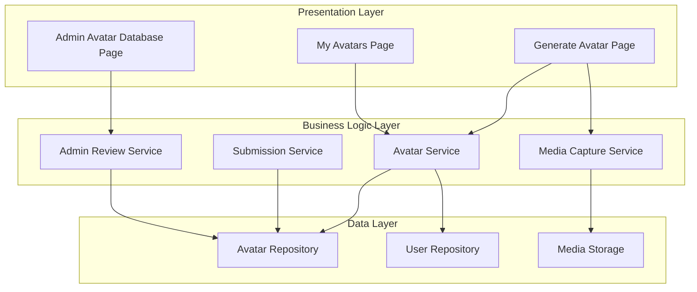

# Design Document: Generate Avatar

## Overview

The Generate Avatar feature enables users to contribute to the sign language avatar database by capturing images or recording videos of sign language gestures. The system provides a streamlined workflow for media capture, metadata entry, submission, and administrative review. This feature supports both user-generated content expansion and quality control through a multi-stage approval process.

The design follows a three-tier architecture with clear separation between presentation (UI components), business logic (services), and data persistence (repositories). The system integrates with device camera APIs for media capture and implements a state-based submission workflow (Pending → Approved/Rejected).

## Architecture

### System Components



### Data Flow

**User Submission Flow:**
1. User navigates to Generate Avatar page
2. User selects capture mode (image/video)
3. System activates camera and displays live preview
4. User captures media
5. System displays preview with retake option
6. User fills in metadata (sign word, language, description)
7. User submits
8. System creates submission with Pending status
9. System redirects to My Avatars page

**Admin Review Flow:**
1. Admin navigates to Avatar Database
2. Admin filters/views pending submissions
3. Admin selects submission for review
4. System displays full submission details
5. Admin approves or rejects
6. System updates submission status
7. Status change reflects on user's My Avatars page

## Components and Interfaces

### 1. Generate Avatar Page Component

**Responsibilities:**
- Render media capture interface
- Manage camera activation and preview
- Handle image capture and video recording
- Collect metadata input
- Validate and submit avatar data

**State Management:**
```typescript
interface GenerateAvatarState {
  captureMode: 'image' | 'video' | null;
  cameraActive: boolean;
  capturedMedia: Blob | null;
  mediaPreviewUrl: string | null;
  signWord: string;
  language: string;
  description: string;
  isSubmitting: boolean;
  validationErrors: ValidationErrors;
}
```

**Key Methods:**
- `activateCamera()`: Initialize camera stream
- `captureImage()`: Capture single frame
- `startRecording()`: Begin video recording
- `stopRecording()`: End video recording
- `retakeMedia()`: Clear captured media and return to preview
- `validateForm()`: Check required fields
- `submitAvatar()`: Create submission

### 2. My Avatars Page Component

**Responsibilities:**
- Display user's avatar submissions
- Show submission status for each avatar
- Render media thumbnails
- Display metadata (sign word, language, description)

**Props:**
```typescript
interface MyAvatarsProps {
  userId: string;
}

interface AvatarSubmissionDisplay {
  id: string;
  mediaUrl: string;
  signWord: string;
  language: string;
  description: string;
  status: 'pending' | 'approved' | 'rejected';
  submittedAt: Date;
}
```

### 3. Admin Avatar Database Page Component

**Responsibilities:**
- Display all submissions across users
- Provide filtering by status
- Enable submission review
- Handle approve/reject actions

**State Management:**
```typescript
interface AdminDatabaseState {
  submissions: AdminSubmissionView[];
  statusFilter: 'all' | 'pending' | 'approved' | 'rejected';
  selectedSubmission: AdminSubmissionView | null;
  isReviewModalOpen: boolean;
}

interface AdminSubmissionView {
  id: string;
  userId: string;
  userName: string;
  mediaUrl: string;
  mediaType: 'image' | 'video';
  signWord: string;
  language: string;
  description: string;
  status: 'pending' | 'approved' | 'rejected';
  submittedAt: Date;
}
```

### 4. Media Capture Service

**Responsibilities:**
- Interface with browser MediaDevices API
- Manage camera stream lifecycle
- Capture images from video stream
- Record video with MediaRecorder API
- Generate preview URLs

**Interface:**
```typescript
interface MediaCaptureService {
  requestCameraAccess(): Promise<MediaStream>;
  captureImageFromStream(stream: MediaStream): Promise<Blob>;
  startVideoRecording(stream: MediaStream): MediaRecorder;
  stopVideoRecording(recorder: MediaRecorder): Promise<Blob>;
  createPreviewUrl(blob: Blob): string;
  revokePreviewUrl(url: string): void;
  stopCameraStream(stream: MediaStream): void;
}
```

### 5. Avatar Service

**Responsibilities:**
- Coordinate avatar submission creation
- Upload media to storage
- Persist submission metadata
- Retrieve user's submissions
- Generate media URLs for display

**Interface:**
```typescript
interface AvatarService {
  createSubmission(data: CreateSubmissionData): Promise<Submission>;
  getUserSubmissions(userId: string): Promise<Submission[]>;
  getSubmissionById(id: string): Promise<Submission>;
  uploadMedia(file: Blob, type: 'image' | 'video'): Promise<string>;
}

interface CreateSubmissionData {
  userId: string;
  mediaBlob: Blob;
  mediaType: 'image' | 'video';
  signWord: string;
  language: string;
  description: string;
}
```

### 6. Admin Review Service

**Responsibilities:**
- Retrieve all submissions with filtering
- Update submission status
- Validate admin permissions
- Log review actions

**Interface:**
```typescript
interface AdminReviewService {
  getAllSubmissions(filter?: StatusFilter): Promise<Submission[]>;
  approveSubmission(submissionId: string, adminId: string): Promise<void>;
  rejectSubmission(submissionId: string, adminId: string): Promise<void>;
  getSubmissionDetails(submissionId: string): Promise<SubmissionDetails>;
}

type StatusFilter = 'all' | 'pending' | 'approved' | 'rejected';
```

### 7. Avatar Repository

**Responsibilities:**
- CRUD operations for submissions
- Query submissions by user
- Query submissions by status
- Update submission status

**Interface:**
```typescript
interface AvatarRepository {
  create(submission: NewSubmission): Promise<Submission>;
  findById(id: string): Promise<Submission | null>;
  findByUserId(userId: string): Promise<Submission[]>;
  findByStatus(status: SubmissionStatus): Promise<Submission[]>;
  findAll(): Promise<Submission[]>;
  updateStatus(id: string, status: SubmissionStatus): Promise<void>;
}
```

## Data Models

### Submission Model

```typescript
interface Submission {
  id: string;
  userId: string;
  mediaUrl: string;
  mediaType: 'image' | 'video';
  signWord: string;
  language: string;
  description: string;
  status: 'pending' | 'approved' | 'rejected';
  submittedAt: Date;
  reviewedAt: Date | null;
  reviewedBy: string | null;
}

interface NewSubmission {
  userId: string;
  mediaUrl: string;
  mediaType: 'image' | 'video';
  signWord: string;
  language: string;
  description: string;
}
```

### Database Schema

**submissions table:**
- `id` (PRIMARY KEY, UUID)
- `user_id` (FOREIGN KEY → users.id)
- `media_url` (VARCHAR, NOT NULL)
- `media_type` (ENUM: 'image', 'video', NOT NULL)
- `sign_word` (VARCHAR, NOT NULL)
- `language` (VARCHAR, NOT NULL)
- `description` (TEXT)
- `status` (ENUM: 'pending', 'approved', 'rejected', DEFAULT 'pending')
- `submitted_at` (TIMESTAMP, DEFAULT CURRENT_TIMESTAMP)
- `reviewed_at` (TIMESTAMP, NULL)
- `reviewed_by` (FOREIGN KEY → users.id, NULL)

**Indexes:**
- `idx_user_id` on `user_id`
- `idx_status` on `status`
- `idx_submitted_at` on `submitted_at`

## Error Handling

### Camera Access Errors

**Scenario:** User denies camera permission or camera unavailable

**Handling:**
- Display user-friendly error message
- Provide instructions for enabling camera access
- Offer alternative: upload pre-recorded media (future enhancement)

**Implementation:**
```typescript
try {
  const stream = await navigator.mediaDevices.getUserMedia({ video: true });
} catch (error) {
  if (error.name === 'NotAllowedError') {
    showError('Camera access denied. Please enable camera permissions.');
  } else if (error.name === 'NotFoundError') {
    showError('No camera found. Please connect a camera device.');
  } else {
    showError('Unable to access camera. Please try again.');
  }
}
```

### Media Capture Errors

**Scenario:** Capture or recording fails

**Handling:**
- Log error details
- Display retry option
- Preserve form data (sign word, language, description)

### Validation Errors

**Scenario:** Required fields missing or invalid

**Handling:**
- Display inline validation messages
- Highlight invalid fields
- Prevent submission until resolved
- Validation rules:
  - Sign word: required, min 1 character
  - Language: required, must be from predefined list
  - Description: optional
  - Media: required, must be captured

### Upload Errors

**Scenario:** Media upload fails

**Handling:**
- Retry upload automatically (max 3 attempts)
- Show progress indicator
- On failure, preserve captured media and form data
- Display error with retry button

### Database Errors

**Scenario:** Submission creation or status update fails

**Handling:**
- Rollback transaction
- Log error for debugging
- Display generic error message to user
- For admin actions, show specific error if status update fails

## Testing Strategy

### Unit Tests

**Media Capture Service:**
- Mock MediaDevices API
- Test camera stream initialization
- Test image capture from stream
- Test video recording start/stop
- Test preview URL generation

**Avatar Service:**
- Mock repository and storage
- Test submission creation flow
- Test media upload
- Test retrieval methods

**Admin Review Service:**
- Mock repository
- Test status update operations
- Test filtering logic
- Test permission validation

### Integration Tests

**Submission Flow:**
- Test end-to-end submission creation
- Verify media storage
- Verify database persistence
- Verify status initialization to 'pending'

**Review Flow:**
- Test admin approval updates status
- Test admin rejection updates status
- Verify status changes persist
- Verify timestamps update correctly

### Component Tests

**Generate Avatar Page:**
- Test camera activation
- Test capture button functionality
- Test retake functionality
- Test form validation
- Test submission flow

**My Avatars Page:**
- Test submission list rendering
- Test status display
- Test empty state

**Admin Database Page:**
- Test submission list rendering
- Test filtering
- Test review modal
- Test approve/reject actions

### E2E Tests

**User Journey:**
1. Navigate to Generate Avatar
2. Capture image
3. Fill metadata
4. Submit
5. Verify redirect to My Avatars
6. Verify submission appears with pending status

**Admin Journey:**
1. Navigate to Avatar Database
2. Filter by pending
3. Select submission
4. Approve submission
5. Verify status updates
6. Verify user sees approved status

## Security Considerations

### Authentication & Authorization

- Verify user authentication before allowing submission creation
- Verify admin role before allowing review actions
- Validate user owns submission when viewing My Avatars

### Media Upload Security

- Validate file types (image: jpg, png, webp; video: mp4, webm)
- Enforce file size limits (image: 5MB, video: 50MB)
- Sanitize filenames
- Store media in isolated storage with restricted access
- Generate signed URLs for media access

### Input Validation

- Sanitize all text inputs (sign word, description)
- Validate language against whitelist
- Prevent SQL injection through parameterized queries
- Prevent XSS through proper output encoding

## Performance Considerations

### Media Handling

- Compress images before upload (target: 1920x1080 max)
- Compress videos before upload (target: 720p, H.264)
- Use lazy loading for media thumbnails
- Implement pagination for submission lists (20 per page)

### Caching

- Cache user's submissions list (invalidate on new submission)
- Cache language dropdown options
- Use CDN for serving approved avatar media

### Database Optimization

- Index frequently queried fields (user_id, status)
- Use database connection pooling
- Implement query result caching for admin dashboard

