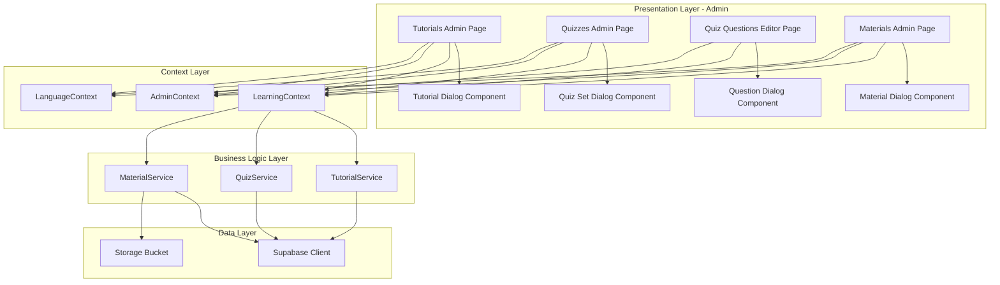

# Design Document: Manage Education Materials

## Overview

The Manage Education Materials feature provides administrators with comprehensive tools to manage all learning content on the SignBridge platform. The system leverages the existing service layer architecture (TutorialService, QuizService, MaterialService) and extends it with admin-specific UI components. The design follows the established patterns in the codebase, using React Context for state management, Supabase for data persistence, and shadcn/ui components for the interface.

This feature integrates seamlessly with the existing learning materials browsing functionality (UC8), ensuring that content managed by admins is immediately available to users. The design emphasizes usability, data validation, and error handling to maintain content quality.

## Architecture

### System Components



### Data Flow

**Tutorial Management Flow:**
1. Admin navigates to tutorials admin page
2. System fetches tutorials via LearningContext
3. Admin clicks add/edit button
4. System displays Tutorial Dialog
5. Admin enters/modifies data and saves
6. System validates input
7. System calls TutorialService create/update method
8. Service persists to Supabase
9. Context refreshes tutorial list
10. UI updates to show changes

**Quiz Management Flow:**
1. Admin navigates to quizzes admin page
2. System fetches quiz sets via LearningContext
3. Admin clicks edit questions on a quiz set
4. System navigates to Question Editor page
5. System fetches questions for the quiz set
6. Admin adds/edits/deletes questions
7. System calls QuizService methods
8. Service persists to Supabase
9. UI updates to show changes

**Material Management Flow:**
1. Admin navigates to materials admin page
2. System fetches materials via LearningContext
3. Admin clicks add/edit button
4. System displays Material Dialog
5. Admin uploads file and enters metadata
6. System validates file and input
7. System uploads file to Supabase Storage
8. System calls MaterialService create/update method
9. Service persists metadata to Supabase
10. Context refreshes material list
11. UI updates to show changes

## Components and Interfaces

### 1. Tutorials Admin Page Component

**Responsibilities:**
- Display list of tutorials with admin controls
- Handle add, edit, delete operations
- Filter tutorials by level
- Manage Tutorial Dialog state

**State Management:**
```typescript
interface TutorialsAdminState {
  activeTab: 'all' | 'beginner' | 'intermediate' | 'advanced';
  editDialogOpen: boolean;
  currentTutorial: TutorialWithProgress | null;
  isSaving: boolean;
}
```

**Key Methods:**
- `handleAddTutorial()`: Open dialog for new tutorial
- `handleEditTutorial(tutorial)`: Open dialog with existing tutorial data
- `handleDeleteTutorial(id)`: Delete tutorial with confirmation
- `handleSaveTutorial(tutorial)`: Validate and save tutorial
- `handleDialogClose(open)`: Manage dialog state

**Integration:**
- Uses `useLearning()` hook for CRUD operations
- Uses `useLanguage()` hook for language filtering
- Uses `useAdmin()` hook for admin verification
- Uses `useAuth()` hook for user identification

### 2. Tutorial Dialog Component

**Responsibilities:**
- Render form for tutorial input
- Validate tutorial data
- Handle YouTube URL extraction
- Display saving state

**Props:**
```typescript
interface TutorialDialogProps {
  open: boolean;
  onOpenChange: (open: boolean) => void;
  tutorial: TutorialWithProgress | null;
  onTutorialChange: (tutorial: TutorialWithProgress) => void;
  onSave: (tutorial: TutorialWithProgress) => Promise<void>;
  isSaving: boolean;
}
```

**Form Fields:**
- Title (text input, required)
- Description (textarea, required)
- Video URL (text input, required, YouTube URL validation)
- Thumbnail URL (auto-extracted from YouTube)
- Level (select dropdown: beginner/intermediate/advanced)

**Validation Rules:**
- Title: min 3 characters, max 200 characters
- Description: min 10 characters
- Video URL: must be valid YouTube URL
- All required fields must be filled

### 3. Quizzes Admin Page Component

**Responsibilities:**
- Display list of quiz sets with admin controls
- Handle add, edit, delete operations for quiz sets
- Navigate to question editor
- Manage Quiz Set Dialog state

**State Management:**
```typescript
interface QuizzesAdminState {
  editDialogOpen: boolean;
  currentQuizSet: QuizSetWithProgress | null;
  isSaving: boolean;
}
```

**Key Methods:**
- `handleAddQuizSet()`: Open dialog for new quiz set
- `handleEditQuizSet(quizSet)`: Open dialog with existing quiz set data
- `handleDeleteQuizSet(id)`: Delete quiz set with confirmation
- `handleSaveTutorial(quizSet)`: Validate and save quiz set
- `handleEditQuestions(quizSetId)`: Navigate to question editor

### 4. Quiz Set Dialog Component

**Responsibilities:**
- Render form for quiz set input
- Validate quiz set data
- Display saving state

**Props:**
```typescript
interface QuizSetDialogProps {
  open: boolean;
  onOpenChange: (open: boolean) => void;
  quizSet: QuizSetWithProgress | null;
  onQuizSetChange: (quizSet: QuizSetWithProgress) => void;
  onSave: (quizSet: QuizSetWithProgress) => Promise<void>;
  isSaving: boolean;
}
```

**Form Fields:**
- Title (text input, required)
- Description (textarea, required)

**Validation Rules:**
- Title: min 3 characters, max 200 characters
- Description: min 10 characters

### 5. Quiz Questions Editor Page Component

**Responsibilities:**
- Display list of questions for a quiz set
- Handle add, edit, delete operations for questions
- Manage question order
- Manage Question Dialog state

**State Management:**
```typescript
interface QuestionEditorState {
  quizSetId: string;
  quizSet: QuizSet | null;
  questions: QuizQuestion[];
  editDialogOpen: boolean;
  currentQuestion: QuizQuestion | null;
  isSaving: boolean;
  isLoading: boolean;
}
```

**Key Methods:**
- `loadQuizSetAndQuestions()`: Fetch quiz set and questions
- `handleAddQuestion()`: Open dialog for new question
- `handleEditQuestion(question)`: Open dialog with existing question data
- `handleDeleteQuestion(id)`: Delete question with confirmation
- `handleSaveQuestion(question)`: Validate and save question

### 6. Question Dialog Component

**Responsibilities:**
- Render form for question input
- Manage multiple choice options
- Validate question data
- Display saving state

**Props:**
```typescript
interface QuestionDialogProps {
  open: boolean;
  onOpenChange: (open: boolean) => void;
  question: QuizQuestion | null;
  quizSetId: string;
  onQuestionChange: (question: QuizQuestion) => void;
  onSave: (question: QuizQuestion) => Promise<void>;
  isSaving: boolean;
}
```

**Form Fields:**
- Question Text (textarea, required)
- Option A (text input, required)
- Option B (text input, required)
- Option C (text input, required)
- Option D (text input, required)
- Correct Answer (radio group, required)
- Explanation (textarea, optional)
- Order Index (number input, auto-assigned)

**Validation Rules:**
- Question text: min 10 characters
- All options: min 1 character, must be unique
- Correct answer: must be selected
- Explanation: optional, max 500 characters

### 7. Materials Admin Page Component

**Responsibilities:**
- Display list of materials with admin controls
- Handle add, edit, delete operations
- Filter materials by level
- Manage Material Dialog state
- Handle file uploads

**State Management:**
```typescript
interface MaterialsAdminState {
  activeTab: 'all' | 'beginner' | 'intermediate' | 'advanced';
  editDialogOpen: boolean;
  currentMaterial: Material | null;
  isSaving: boolean;
  uploadProgress: number;
}
```

**Key Methods:**
- `handleAddMaterial()`: Open dialog for new material
- `handleEditMaterial(material)`: Open dialog with existing material data
- `handleDeleteMaterial(id)`: Delete material and file with confirmation
- `handleSaveMaterial(material, file)`: Validate, upload file, and save material

### 8. Material Dialog Component

**Responsibilities:**
- Render form for material input
- Handle file upload
- Validate material data and file
- Display upload progress
- Display saving state

**Props:**
```typescript
interface MaterialDialogProps {
  open: boolean;
  onOpenChange: (open: boolean) => void;
  material: Material | null;
  onMaterialChange: (material: Material) => void;
  onSave: (material: Material, file: File | null) => Promise<void>;
  isSaving: boolean;
  uploadProgress: number;
}
```

**Form Fields:**
- Title (text input, required)
- Description (textarea, required)
- Level (select dropdown: beginner/intermediate/advanced)
- File Upload (file input, required for new materials)

**File Validation:**
- Allowed types: PDF, DOC, DOCX, PPT, PPTX
- Max size: 10MB
- File name sanitization

**Validation Rules:**
- Title: min 3 characters, max 200 characters
- Description: min 10 characters
- File: required for new materials, optional for edits

### 9. Learning Context Extension

**Additional Methods for Admin:**
```typescript
interface LearningContextAdmin {
  // Existing methods from UC8
  tutorials: TutorialWithProgress[];
  quizSets: QuizSetWithProgress[];
  materials: Material[];
  getTutorials: (language: string) => Promise<void>;
  getQuizSets: (language: string) => Promise<void>;
  getMaterials: (language: string) => Promise<void>;
  
  // New admin methods
  createTutorial: (tutorial: TutorialInsert) => Promise<void>;
  updateTutorial: (id: string, updates: TutorialUpdate) => Promise<void>;
  deleteTutorial: (id: string) => Promise<void>;
  
  createQuizSet: (quizSet: QuizSetInsert) => Promise<void>;
  updateQuizSet: (id: string, updates: QuizSetUpdate) => Promise<void>;
  deleteQuizSet: (id: string) => Promise<void>;
  
  createQuizQuestion: (question: QuizQuestionInsert) => Promise<void>;
  updateQuizQuestion: (id: string, updates: QuizQuestionUpdate) => Promise<void>;
  deleteQuizQuestion: (id: string) => Promise<void>;
  getQuizQuestions: (quizSetId: string) => Promise<QuizQuestion[]>;
  
  createMaterial: (material: MaterialInsert, file: File) => Promise<void>;
  updateMaterial: (id: string, updates: MaterialUpdate, file?: File) => Promise<void>;
  deleteMaterial: (id: string) => Promise<void>;
  
  tutorialsLoading: boolean;
  quizSetsLoading: boolean;
  materialsLoading: boolean;
}
```

## Data Models

### Existing Models (from database.ts)

The system uses existing database models:
- `Tutorial` - from tutorials table
- `QuizSet` - from quiz_sets table
- `QuizQuestion` - from quiz_questions table
- `Material` - from materials table

### Extended Types

```typescript
// For admin operations
type TutorialInsert = Database['public']['Tables']['tutorials']['Insert'];
type TutorialUpdate = Database['public']['Tables']['tutorials']['Update'];
type QuizSetInsert = Database['public']['Tables']['quiz_sets']['Insert'];
type QuizSetUpdate = Database['public']['Tables']['quiz_sets']['Update'];
type QuizQuestionInsert = Database['public']['Tables']['quiz_questions']['Insert'];
type QuizQuestionUpdate = Database['public']['Tables']['quiz_questions']['Update'];
type MaterialInsert = Database['public']['Tables']['materials']['Insert'];
type MaterialUpdate = Database['public']['Tables']['materials']['Update'];
```

## Service Layer Integration

### TutorialService (Existing)

Already implements admin methods:
- `createTutorial(tutorial)` - Create new tutorial
- `updateTutorial(id, updates)` - Update existing tutorial
- `deleteTutorial(id)` - Delete tutorial

### QuizService (Existing)

Already implements admin methods:
- `createQuizSet(quizSet)` - Create new quiz set
- `updateQuizSet(id, updates)` - Update existing quiz set
- `deleteQuizSet(id)` - Delete quiz set
- `createQuizQuestion(question)` - Create new question
- `updateQuizQuestion(id, updates)` - Update existing question
- `deleteQuizQuestion(id)` - Delete question

### MaterialService (Existing)

Already implements admin methods:
- `createMaterial(material)` - Create new material
- `updateMaterial(id, updates)` - Update existing material
- `deleteMaterial(id)` - Delete material and file
- `uploadMaterialFile(file, fileName)` - Upload file to storage
- `deleteMaterialFile(filePath)` - Delete file from storage

**No new service methods needed** - all required functionality exists!

## Error Handling

### Validation Errors

**Scenario:** User submits form with invalid data

**Handling:**
- Display inline validation errors
- Highlight invalid fields
- Prevent submission until resolved
- Show toast notification with specific error

### Network Errors

**Scenario:** API call fails due to network issues

**Handling:**
- Display error toast with retry option
- Preserve form data
- Log error details
- Don't close dialog on error

### File Upload Errors

**Scenario:** File upload fails or file is invalid

**Handling:**
- Validate file type and size before upload
- Display progress indicator during upload
- Show specific error message (file too large, invalid type, etc.)
- Allow user to select different file

### Delete Confirmation

**Scenario:** Admin attempts to delete content

**Handling:**
- Display confirmation dialog
- Show warning about permanent deletion
- For quiz sets, warn about deleting all questions
- For materials, warn about deleting file from storage
- Require explicit confirmation

### Concurrent Edit Protection

**Scenario:** Multiple admins editing same content

**Handling:**
- Use optimistic locking with updated_at timestamp
- Display error if content was modified by another admin
- Offer to reload and retry
- Log conflict for debugging

## Testing Strategy

### Unit Tests

**Service Methods:**
- Test CRUD operations for tutorials, quizzes, materials
- Mock Supabase client
- Test error handling

**Validation Logic:**
- Test form validation rules
- Test file validation
- Test URL validation for YouTube links

### Component Tests

**Dialog Components:**
- Test form rendering
- Test validation display
- Test save/cancel actions
- Test loading states

**Admin Pages:**
- Test content list rendering
- Test add/edit/delete actions
- Test filtering
- Test dialog state management

### Integration Tests

**Tutorial Management:**
- Test end-to-end tutorial creation
- Test tutorial update flow
- Test tutorial deletion
- Verify database persistence

**Quiz Management:**
- Test quiz set creation
- Test question management
- Test quiz set deletion with questions
- Verify database persistence

**Material Management:**
- Test material creation with file upload
- Test material update with file replacement
- Test material deletion with file removal
- Verify storage and database persistence

### E2E Tests

**Admin Journey - Tutorials:**
1. Login as admin
2. Navigate to tutorials admin
3. Add new tutorial
4. Edit tutorial
5. Delete tutorial
6. Verify changes persist

**Admin Journey - Quizzes:**
1. Login as admin
2. Navigate to quizzes admin
3. Add new quiz set
4. Navigate to question editor
5. Add questions
6. Edit questions
7. Delete questions
8. Delete quiz set
9. Verify changes persist

**Admin Journey - Materials:**
1. Login as admin
2. Navigate to materials admin
3. Upload new material
4. Edit material
5. Replace file
6. Delete material
7. Verify file removed from storage

## Security Considerations

### Authentication & Authorization

- Verify admin role before allowing access to admin pages
- Use AdminContext to check admin status
- Implement route guards for admin-only pages
- Verify admin role on server-side for all mutations

### Input Validation

- Sanitize all text inputs
- Validate URLs (YouTube links)
- Validate file types and sizes
- Prevent SQL injection through parameterized queries
- Prevent XSS through proper output encoding

### File Upload Security

- Validate file types on client and server
- Enforce file size limits
- Sanitize file names
- Store files in isolated storage bucket
- Use signed URLs for file access
- Scan uploaded files for malware (future enhancement)

### Data Integrity

- Use database transactions for related operations
- Cascade delete for quiz sets and questions
- Clean up orphaned files in storage
- Validate foreign key relationships

## Performance Considerations

### Content Loading

- Implement pagination for large content lists (20 items per page)
- Cache content lists in LearningContext
- Lazy load thumbnails and previews
- Use optimistic UI updates

### File Upload

- Show upload progress indicator
- Compress large files before upload
- Use chunked upload for large files
- Implement upload retry logic

### Database Optimization

- Use existing indexes on tables
- Batch operations where possible
- Use database connection pooling
- Cache frequently accessed data

### UI Responsiveness

- Prevent multiple simultaneous saves
- Disable buttons during operations
- Show loading states
- Use debouncing for search/filter inputs

## Alignment with Existing Codebase

### Follows Established Patterns

1. **Service Layer**: Uses existing TutorialService, QuizService, MaterialService
2. **Context Pattern**: Extends LearningContext with admin methods
3. **Component Structure**: Follows pattern from tutorials page (Header, Grid, Dialog, EmptyState, LoadingState)
4. **UI Components**: Uses shadcn/ui components (Dialog, Button, Input, Textarea, Select, etc.)
5. **State Management**: Uses React hooks and context
6. **Error Handling**: Uses toast notifications via sonner
7. **Routing**: Uses Next.js App Router
8. **Styling**: Uses Tailwind CSS

### Reuses Existing Components

- Tutorial/Quiz/Material Card components
- Dialog components
- Loading and empty state components
- Header components with tabs

### Extends Existing Services

- No new services needed
- All CRUD methods already exist
- Only need to wire up UI to existing service methods

