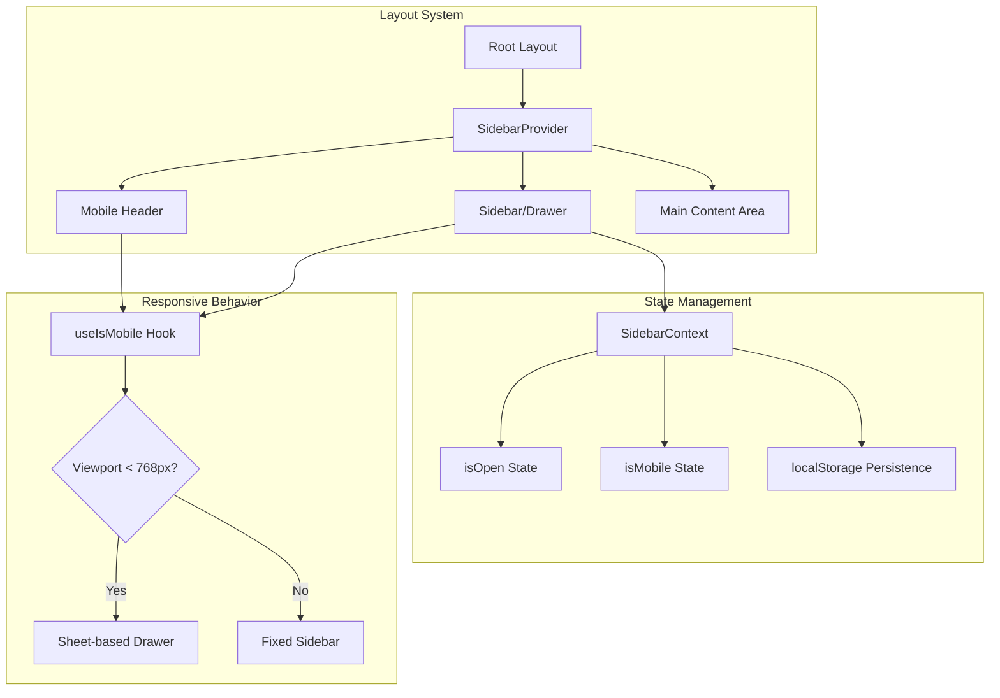
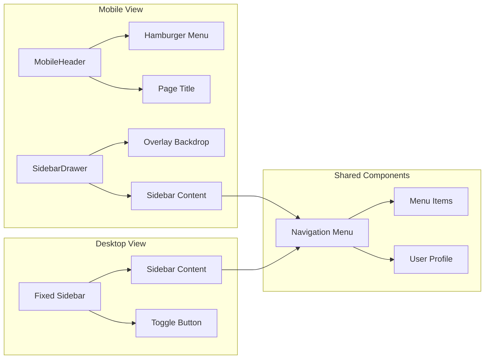

# Mobile-Friendly Design - Design Document

## Overview

This design document outlines the architecture and implementation approach for making the SignBridge web application mobile-friendly while maintaining the sidebar navigation pattern. The solution leverages the existing shadcn/ui component library and Tailwind CSS responsive utilities to create a seamless experience across all device sizes.

The core approach transforms the desktop sidebar into a slide-out drawer on mobile devices, triggered by a hamburger menu in a fixed header. This maintains navigation consistency while maximizing content space on smaller screens.

## Architecture

### High-Level Architecture



### Component Architecture



## Components and Interfaces

### 1. Enhanced SidebarContext

```typescript
interface SidebarState {
  isOpen: boolean;
  isMobile: boolean;
}

interface SidebarContextType {
  state: SidebarState;
  toggleSidebar: () => void;
  openSidebar: () => void;
  closeSidebar: () => void;
  setMobile: (isMobile: boolean) => void;
}
```

### 2. MobileHeader Component

```typescript
interface MobileHeaderProps {
  title?: string;
  onMenuClick: () => void;
  showBackButton?: boolean;
  onBackClick?: () => void;
}
```

**Responsibilities:**
- Display hamburger menu button (left side)
- Show current page title (center)
- Optional back button for nested views
- Fixed position at top of viewport
- Height: 56px on mobile

### 3. Enhanced AppSidebar Component

```typescript
interface AppSidebarProps {
  userRole: 'admin' | 'non-deaf' | 'deaf';
}
```

**Behavior:**
- Desktop (≥768px): Fixed sidebar with collapse/expand toggle
- Mobile (<768px): Sheet-based drawer with overlay backdrop

### 4. Responsive Layout Wrapper

```typescript
interface ResponsiveLayoutProps {
  children: React.ReactNode;
  pageTitle?: string;
  showMobileHeader?: boolean;
}
```

## Data Models

### Sidebar State Persistence

```typescript
interface PersistedSidebarState {
  desktopExpanded: boolean;  // Desktop sidebar expanded/collapsed
  lastUpdated: number;       // Timestamp for cache invalidation
}

// localStorage key: 'signbridge_sidebar_state'
```

### Breakpoint Configuration

```typescript
const BREAKPOINTS = {
  mobile: 768,    // < 768px
  tablet: 1024,   // 768px - 1023px
  desktop: 1024,  // >= 1024px
} as const;

const SIDEBAR_WIDTHS = {
  expanded: '16rem',      // 256px
  collapsed: '5rem',      // 80px
  mobileDrawer: '18rem',  // 288px
} as const;
```

## Correctness Properties

*A property is a characteristic or behavior that should hold true across all valid executions of a system-essentially, a formal statement about what the system should do. Properties serve as the bridge between human-readable specifications and machine-verifiable correctness guarantees.*

Based on the prework analysis, the following correctness properties have been identified:

### Property 1: Mobile Sidebar Hidden by Default
*For any* viewport width less than 768px, the sidebar SHALL be hidden (not visible in the DOM or visually hidden) and a hamburger menu button SHALL be visible in the header.
**Validates: Requirements 1.1**

### Property 2: Navigation Item Closes Sidebar
*For any* navigation item in the mobile sidebar drawer, clicking it SHALL result in the sidebar closing AND navigation occurring to the target page.
**Validates: Requirements 1.4**

### Property 3: Mobile Grid Single Column
*For any* grid-based content container on viewports less than 768px, the computed grid-template-columns SHALL resolve to a single column layout.
**Validates: Requirements 2.1**

### Property 4: Mobile Card Full Width
*For any* card component on viewports less than 768px, the card width SHALL be 100% of its container (minus padding).
**Validates: Requirements 2.4**

### Property 5: Touch Target Minimum Size
*For any* interactive button element on mobile viewports, the computed height and width SHALL be at least 44px.
**Validates: Requirements 3.1**

### Property 6: Navigation Item Spacing
*For any* pair of adjacent navigation menu items, the spacing between them SHALL be at least 8px.
**Validates: Requirements 3.2**

### Property 7: Fixed Header on Scroll
*For any* scroll position on mobile viewports, the mobile header SHALL remain at position:fixed with top:0.
**Validates: Requirements 4.2**

### Property 8: Consistent Header Height
*For any* page in the application on mobile viewports, the mobile header height SHALL be between 56px and 64px.
**Validates: Requirements 4.3**

### Property 9: Mobile Heading Font Sizes
*For any* heading element on mobile viewports, the computed font-size SHALL be at least: h1=24px, h2=20px, h3=18px.
**Validates: Requirements 5.1**

### Property 10: Body Text Minimum Size
*For any* body text element on mobile viewports, the computed font-size SHALL be at least 16px.
**Validates: Requirements 5.2**

### Property 11: Container Padding Minimum
*For any* main content container on mobile viewports, the horizontal padding SHALL be at least 16px.
**Validates: Requirements 5.3**

### Property 12: Message Bubble Max Width
*For any* chat message bubble on mobile viewports, the max-width SHALL be 85% of the container width.
**Validates: Requirements 6.4**

### Property 13: Forum Post Single Column
*For any* forum post list on mobile viewports, the posts SHALL display in a single column layout.
**Validates: Requirements 7.1**

### Property 14: No Horizontal Overflow
*For any* page content on mobile viewports, there SHALL be no horizontal scrollbar (overflow-x: hidden or auto with no overflow).
**Validates: Requirements 7.2**

### Property 15: Sidebar State Persistence
*For any* sidebar toggle action on desktop, the state SHALL be persisted to localStorage and restored on page reload.
**Validates: Requirements 10.2, 10.3**

## Error Handling

### Viewport Detection Errors
- **Scenario**: SSR/hydration mismatch for viewport detection
- **Handling**: Default to desktop view during SSR, update on client hydration
- **Implementation**: Use `useEffect` for client-side viewport detection with initial undefined state

### LocalStorage Errors
- **Scenario**: localStorage unavailable (private browsing, storage full)
- **Handling**: Gracefully degrade to session-only state, no persistence
- **Implementation**: Wrap localStorage calls in try-catch, use fallback defaults

### Touch Event Handling
- **Scenario**: Touch events not supported on older browsers
- **Handling**: Fall back to click events
- **Implementation**: Use pointer events where possible for unified handling

## Testing Strategy

### Dual Testing Approach

This implementation requires both unit tests and property-based tests to ensure comprehensive coverage.

#### Unit Tests
Unit tests will verify specific examples and edge cases:

1. **Component Rendering Tests**
   - MobileHeader renders with correct elements
   - Sidebar renders as Sheet on mobile viewport
   - Sidebar renders as fixed element on desktop viewport

2. **Interaction Tests**
   - Hamburger menu click opens sidebar drawer
   - Overlay click closes sidebar drawer
   - Navigation item click closes sidebar and navigates

3. **State Management Tests**
   - SidebarContext provides correct initial state
   - Toggle functions update state correctly
   - localStorage persistence works correctly

#### Property-Based Testing

**Testing Framework**: fast-check (JavaScript property-based testing library)

Property-based tests will verify universal properties across many inputs:

1. **Viewport-based Properties**
   - Generate random viewport widths
   - Verify sidebar visibility rules hold for all widths

2. **Touch Target Properties**
   - Generate random button configurations
   - Verify minimum size constraints

3. **Layout Properties**
   - Generate random content configurations
   - Verify responsive grid behavior

**Configuration**: Each property test will run a minimum of 100 iterations.

**Test Annotation Format**: Each property-based test will be tagged with:
```typescript
// **Feature: mobile-friendly-design, Property {number}: {property_text}**
```

### Test File Structure

```
src/
├── __tests__/
│   ├── components/
│   │   ├── AppSidebar.test.tsx
│   │   ├── MobileHeader.test.tsx
│   │   └── ResponsiveLayout.test.tsx
│   ├── context/
│   │   └── SidebarContext.test.tsx
│   └── properties/
│       ├── viewport.property.test.ts
│       ├── touch-targets.property.test.ts
│       └── layout.property.test.ts
```

## Implementation Approach

### Phase 1: Core Infrastructure
1. Enhance SidebarContext with mobile detection
2. Update useIsMobile hook for SSR compatibility
3. Add localStorage persistence for sidebar state

### Phase 2: Mobile Navigation
1. Create MobileHeader component
2. Refactor AppSidebar to use Sheet on mobile
3. Implement overlay backdrop and close behaviors

### Phase 3: Responsive Layouts
1. Update global CSS with mobile-first responsive utilities
2. Refactor grid layouts across all pages
3. Ensure touch-friendly button sizes

### Phase 4: Page-Specific Optimizations
1. Chat interface mobile view
2. Forum interface mobile view
3. Learning content mobile view
4. Gesture recognition mobile view

### CSS Utility Classes

```css
/* Mobile-first responsive utilities */
.mobile-header { @apply fixed top-0 left-0 right-0 h-14 z-50 bg-white border-b; }
.mobile-content { @apply pt-14 md:pt-0; }
.touch-target { @apply min-h-[44px] min-w-[44px]; }
.mobile-padding { @apply px-4 md:px-6; }
.mobile-grid { @apply grid grid-cols-1 md:grid-cols-2 lg:grid-cols-3 gap-4 md:gap-6; }
```

### Tailwind Breakpoint Usage

| Breakpoint | Width | Usage |
|------------|-------|-------|
| Default | <768px | Mobile styles (base) |
| `md:` | ≥768px | Tablet/Desktop styles |
| `lg:` | ≥1024px | Large desktop styles |
| `xl:` | ≥1280px | Extra large screens |
