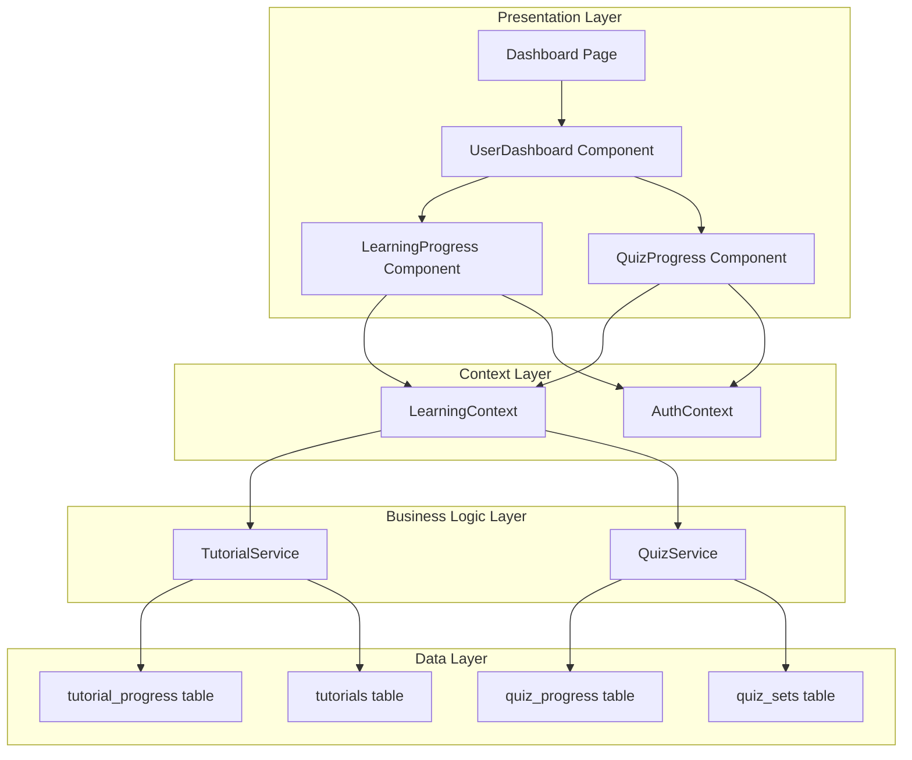

# Design Document: Track User Learning Progress

## Overview

The Track User Learning Progress feature provides real-time visibility into user learning activities on the SignBridge platform. The system leverages existing database tables (tutorial_progress, quiz_progress) and service methods to automatically track and display user progress. The design integrates seamlessly with the existing LearningContext, dashboard components, and learning material interactions (UC8).

**Key Design Principle**: Progress tracking is **already implemented** in the codebase. This spec documents the existing architecture and identifies minor enhancements to ensure complete UC10 functionality.

## Architecture

### System Components



### Data Flow

**Dashboard Load Flow:**
1. User navigates to dashboard
2. Dashboard component renders UserDashboard
3. UserDashboard renders LearningProgress and QuizProgress components
4. LearningProgress calls LearningContext.getTutorials()
5. QuizProgress calls LearningContext.getQuizSets()
6. Context calls TutorialService and QuizService
7. Services fetch data from Supabase (tutorials with progress, quizzes with progress)
8. Components calculate and display metrics
9. Loading states transition to data display

**Progress Update Flow (Tutorial):**
1. User marks tutorial as started/completed
2. Tutorial component calls LearningContext.startTutorial() or markTutorialDone()
3. Context calls TutorialService method
4. Service updates tutorial_progress table
5. Context updates local state optimistically
6. Dashboard components re-render with new data
7. Toast notification confirms update

**Progress Update Flow (Quiz):**
1. User submits quiz answers
2. Quiz component calls LearningContext.submitQuizAnswers()
3. Context calls QuizService.submitQuizAnswers()
4. Service calculates score and updates quiz_progress table
5. Context updates local state with quiz result
6. Dashboard components re-render with new data
7. Toast notification shows score

## Components and Interfaces

### 1. Dashboard Page Component (Existing)

**Location**: `src/app/(main)/dashboard/page.tsx`

**Responsibilities:**
- Determine user role (admin/deaf/non-deaf)
- Render appropriate dashboard (AdminDashboard or UserDashboard)
- Handle proficiency test prompt

**Current Implementation**: ✅ Complete

### 2. UserDashboard Component (Existing)

**Location**: `src/components/UserDashboard.tsx`

**Responsibilities:**
- Layout dashboard for non-admin users
- Render LearningProgress component
- Render QuizProgress component
- Render UserQuickAccessPanel
- Apply animations

**Props:**
```typescript
interface UserDashboardProps {
  userRole: 'non-deaf' | 'deaf';
}
```

**Current Implementation**: ✅ Complete

### 3. LearningProgress Component (Existing)

**Location**: `src/components/user/LearningProgress.tsx`

**Responsibilities:**
- Fetch tutorials with user progress
- Calculate tutorial metrics
- Display overall completion percentage
- Display started, in-progress, and completed counts
- Show loading state

**State Management:**
```typescript
interface LearningProgressState {
  isLoading: boolean;
}
```

**Metrics Calculation:**
```typescript
const startedTutorials = tutorials.filter(t => 
  t.status === 'started' || t.status === 'completed'
);
const inProgressTutorials = tutorials.filter(t => 
  t.status === 'started'
);
const completedTutorials = tutorials.filter(t => 
  t.status === 'completed'
);
const totalProgress = startedTutorials.length > 0 
  ? Math.round((completedTutorials.length / startedTutorials.length) * 100)
  : 0;
```

**Current Implementation**: ✅ Complete
- Fetches tutorials via LearningContext
- Calculates all required metrics
- Displays progress bar and counts
- Handles loading state

### 4. QuizProgress Component (Existing)

**Location**: `src/components/user/QuizProgress.tsx`

**Responsibilities:**
- Fetch quiz sets with user progress
- Calculate quiz metrics
- Display overall quiz completion percentage
- Display individual quiz scores
- Show progress bars for each quiz
- Show loading state

**Metrics Calculation:**
```typescript
const attemptedQuizzes = quizSets.filter(q => q.progress);
const totalQuizzes = quizSets.length;
const overallCompletion = totalQuizzes > 0
  ? Math.round((attemptedQuizzes.length / totalQuizzes) * 100)
  : 0;

// For each quiz:
const progressPercentage = progress 
  ? (progress.score / progress.total_questions) * 100 
  : 0;
```

**Current Implementation**: ✅ Complete
- Fetches quiz sets via LearningContext
- Calculates overall completion
- Displays individual quiz scores
- Shows progress bars
- Handles loading state

### 5. LearningContext (Existing)

**Location**: `src/context/LearningContext.tsx`

**Progress Tracking Methods:**
```typescript
interface LearningContextProgress {
  // Tutorial progress
  startTutorial: (tutorialId: string) => Promise<void>;
  markTutorialDone: (tutorialId: string) => Promise<void>;
  getOverallProgress: () => Promise<{
    totalStarted: number;
    totalCompleted: number;
    completionPercentage: number;
  }>;
  
  // Quiz progress
  submitQuizAnswers: (
    quizSetId: string,
    answers: { questionId: string; answer: string }[]
  ) => Promise<{
    score: number;
    totalQuestions: number;
    passed: boolean;
  }>;
  
  // Data with progress
  tutorials: TutorialWithProgress[];
  quizSets: QuizSetWithProgress[];
  
  // Loading states
  tutorialsLoading: boolean;
  quizSetsLoading: boolean;
}
```

**Current Implementation**: ✅ Complete
- All progress tracking methods implemented
- Optimistic UI updates
- Toast notifications
- Error handling

### 6. TutorialService (Existing)

**Location**: `src/lib/services/tutorialService.ts`

**Progress Methods:**
```typescript
class TutorialService {
  static async getTutorials(
    userId?: string,
    language?: 'ASL' | 'MSL'
  ): Promise<TutorialWithProgress[]>;
  
  static async startTutorial(
    userId: string,
    tutorialId: string
  ): Promise<TutorialProgress>;
  
  static async markTutorialDone(
    userId: string,
    tutorialId: string
  ): Promise<TutorialProgress>;
  
  static async getOverallProgress(userId: string): Promise<{
    totalStarted: number;
    totalCompleted: number;
    completionPercentage: number;
  }>;
}
```

**Current Implementation**: ✅ Complete
- Fetches tutorials with user-specific status
- Creates/updates tutorial_progress records
- Calculates aggregate metrics
- Handles upsert logic

### 7. QuizService (Existing)

**Location**: `src/lib/services/quizService.ts`

**Progress Methods:**
```typescript
class QuizService {
  static async getQuizSets(
    userId?: string,
    language?: 'ASL' | 'MSL'
  ): Promise<QuizSetWithProgress[]>;
  
  static async submitQuizAnswers(
    userId: string,
    quizSetId: string,
    answers: { questionId: string; answer: string }[]
  ): Promise<{
    score: number;
    totalQuestions: number;
    passed: boolean;
  }>;
  
  static async getUserQuizProgress(
    userId: string
  ): Promise<QuizProgress[]>;
}
```

**Current Implementation**: ✅ Complete
- Fetches quiz sets with user progress
- Calculates quiz scores
- Creates/updates quiz_progress records
- Validates answers against correct answers

## Data Models

### Existing Database Schema

**tutorial_progress table:**
```sql
CREATE TABLE tutorial_progress (
  id UUID PRIMARY KEY DEFAULT uuid_generate_v4(),
  user_id UUID NOT NULL REFERENCES user_profiles(id),
  tutorial_id UUID NOT NULL REFERENCES tutorials(id),
  status TEXT NOT NULL CHECK (status IN ('started', 'completed')),
  last_watched_at TIMESTAMP NOT NULL,
  created_at TIMESTAMP DEFAULT NOW(),
  updated_at TIMESTAMP DEFAULT NOW(),
  UNIQUE(user_id, tutorial_id)
);
```

**quiz_progress table:**
```sql
CREATE TABLE quiz_progress (
  id UUID PRIMARY KEY DEFAULT uuid_generate_v4(),
  user_id UUID NOT NULL REFERENCES user_profiles(id),
  quiz_set_id UUID NOT NULL REFERENCES quiz_sets(id),
  completed BOOLEAN DEFAULT FALSE,
  score INTEGER NOT NULL,
  total_questions INTEGER NOT NULL,
  last_attempted_at TIMESTAMP NOT NULL,
  created_at TIMESTAMP DEFAULT NOW(),
  updated_at TIMESTAMP DEFAULT NOW()
);
```

**TypeScript Types (Existing):**
```typescript
interface TutorialProgress {
  id: string;
  user_id: string;
  tutorial_id: string;
  status: 'started' | 'completed';
  last_watched_at: string;
  created_at: string;
  updated_at: string;
}

interface QuizProgress {
  id: string;
  user_id: string;
  quiz_set_id: string;
  completed: boolean;
  score: number;
  total_questions: number;
  last_attempted_at: string;
  created_at: string;
  updated_at: string;
}

interface TutorialWithProgress extends Tutorial {
  status?: 'not-started' | 'started' | 'completed';
}

interface QuizSetWithProgress extends QuizSet {
  questionCount: number;
  progress?: QuizProgress;
}
```

## Progress Calculation Logic

### Tutorial Progress Metrics

**Started Tutorials:**
```typescript
const startedTutorials = tutorials.filter(t => 
  t.status === 'started' || t.status === 'completed'
);
```

**In-Progress Tutorials:**
```typescript
const inProgressTutorials = tutorials.filter(t => 
  t.status === 'started'
);
```

**Completed Tutorials:**
```typescript
const completedTutorials = tutorials.filter(t => 
  t.status === 'completed'
);
```

**Completion Percentage:**
```typescript
const completionPercentage = startedTutorials.length > 0
  ? Math.round((completedTutorials.length / startedTutorials.length) * 100)
  : 0;
```

### Quiz Progress Metrics

**Attempted Quizzes:**
```typescript
const attemptedQuizzes = quizSets.filter(q => q.progress);
```

**Overall Quiz Completion:**
```typescript
const overallCompletion = totalQuizzes > 0
  ? Math.round((attemptedQuizzes.length / totalQuizzes) * 100)
  : 0;
```

**Individual Quiz Score:**
```typescript
const scorePercentage = progress
  ? Math.round((progress.score / progress.total_questions) * 100)
  : 0;
```

## Real-Time Updates

### Optimistic UI Updates

The system uses optimistic updates for immediate feedback:

**Tutorial Status Update:**
```typescript
// Update local state immediately
setTutorials(prev => prev.map(t => 
  t.id === tutorialId ? { ...t, status: 'completed' } : t
));

// Then persist to database
await TutorialService.markTutorialDone(userId, tutorialId);
```

**Quiz Result Update:**
```typescript
// Update local state with result
setQuizSets(prev => prev.map(q => 
  q.id === quizSetId 
    ? { ...q, progress: newProgressData }
    : q
));

// Database update happens in service call
```

### State Synchronization

- LearningContext maintains single source of truth
- Components subscribe to context state
- React re-renders components when state changes
- No manual refresh required

## Error Handling

### Data Fetch Errors

**Scenario:** Failed to load progress data

**Handling:**
- Display loading state during fetch
- Show error toast if fetch fails
- Log error details
- Allow retry via page refresh

**Current Implementation**: ✅ Complete in LearningContext

### Progress Update Errors

**Scenario:** Failed to update progress

**Handling:**
- Display error toast with specific message
- Revert optimistic update if needed
- Log error for debugging
- Allow user to retry action

**Current Implementation**: ✅ Complete in LearningContext

### Authentication Errors

**Scenario:** User not authenticated

**Handling:**
- Check for currentUser before operations
- Redirect to login if not authenticated
- Display appropriate message

**Current Implementation**: ✅ Complete via AuthContext

## Testing Strategy

### Unit Tests

**Progress Calculation:**
- Test tutorial metrics calculation
- Test quiz metrics calculation
- Test edge cases (no data, all completed, etc.)

**Service Methods:**
- Test startTutorial with valid data
- Test markTutorialDone with valid data
- Test submitQuizAnswers with correct/incorrect answers
- Test getOverallProgress calculation

### Component Tests

**LearningProgress Component:**
- Test rendering with data
- Test loading state
- Test empty state (no tutorials)
- Test metrics display

**QuizProgress Component:**
- Test rendering with data
- Test loading state
- Test individual quiz score display
- Test overall completion display

### Integration Tests

**Progress Tracking Flow:**
- Test tutorial start updates dashboard
- Test tutorial completion updates dashboard
- Test quiz submission updates dashboard
- Verify database persistence

**Cross-Session Persistence:**
- Test progress persists after logout/login
- Verify data retrieval on dashboard load

### E2E Tests

**User Journey:**
1. Login as user
2. View dashboard (initial state)
3. Start a tutorial
4. Return to dashboard (verify started count increased)
5. Complete tutorial
6. Return to dashboard (verify completed count increased)
7. Take a quiz
8. Return to dashboard (verify quiz score displayed)
9. Logout and login
10. Verify all progress persists

## Performance Considerations

### Data Loading

- Fetch tutorials and quizzes in parallel
- Use separate loading states for each section
- Cache data in LearningContext
- Avoid redundant API calls

**Current Implementation**: ✅ Complete
- Separate loading states (tutorialsLoading, quizSetsLoading)
- Parallel fetching via useEffect
- Context caching

### Progress Calculations

- Calculate metrics in components (client-side)
- Use memoization for expensive calculations
- Filter operations are O(n) - acceptable for typical data sizes

**Optimization Opportunity**: Add useMemo for metric calculations

### Real-Time Updates

- Optimistic updates provide instant feedback
- Actual database updates happen asynchronously
- Toast notifications confirm persistence

**Current Implementation**: ✅ Complete

## Security Considerations

### Data Access Control

- Progress data filtered by user_id
- Database RLS policies enforce user isolation
- Services validate user authentication

**Current Implementation**: ✅ Complete
- All service methods check userId
- Supabase RLS policies in place

### Data Integrity

- UNIQUE constraint on (user_id, tutorial_id) prevents duplicates
- Upsert logic handles concurrent updates
- Foreign key constraints maintain referential integrity

**Current Implementation**: ✅ Complete

## Alignment with Existing Codebase

### Fully Implemented Features

✅ **Dashboard Display** - UserDashboard component renders progress panels
✅ **Tutorial Progress Tracking** - LearningProgress component with all metrics
✅ **Quiz Progress Tracking** - QuizProgress component with scores
✅ **Real-Time Updates** - Optimistic UI updates in LearningContext
✅ **Service Layer** - TutorialService and QuizService with progress methods
✅ **Database Schema** - tutorial_progress and quiz_progress tables
✅ **Loading States** - Separate loading indicators for each section
✅ **Error Handling** - Toast notifications and error logging
✅ **Authentication Integration** - Uses AuthContext for user identification

### Minor Enhancements Needed

🔧 **Performance Optimization** - Add useMemo for metric calculations
🔧 **Empty State Handling** - Improve messaging when no progress exists
🔧 **Progress Visualization** - Consider adding charts/graphs (optional)

### No New Services Required

All required functionality exists in:
- TutorialService
- QuizService
- LearningContext
- Dashboard components

## Summary

The Track User Learning Progress feature is **already fully implemented** in the codebase. The existing architecture provides:

1. Automatic progress tracking for tutorials and quizzes
2. Real-time dashboard updates
3. Persistent progress across sessions
4. Comprehensive metrics and visualizations
5. Robust error handling and loading states

The implementation follows React best practices, uses TypeScript for type safety, and integrates seamlessly with Supabase for data persistence. Minor optimizations can enhance performance, but the core functionality is complete and operational.

