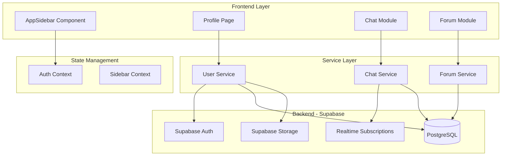
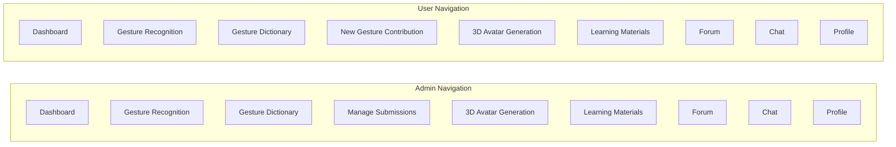

# Design Document: UI Navigation Restructure

## Overview

This design document outlines the comprehensive restructuring of the SignBridge application's UI and navigation system. The changes aim to simplify the user experience by flattening navigation hierarchies, fixing existing bugs in Chat and Forum modules, and adding new features like profile editing and unread message indicators.

The implementation follows a component-based architecture using React with Next.js, leveraging Supabase for real-time features and data persistence.

## Architecture

### High-Level Architecture



### Navigation Flow



## Components and Interfaces

### 1. AppSidebar Component

**File:** `src/components/AppSidebar.tsx`

**Interface:**
```typescript
interface MenuItem {
  title: string;
  href: string;
  icon: LucideIcon;
  roles?: ('admin' | 'deaf' | 'non-deaf')[];  // If undefined, shown to all
}

interface AppSidebarProps {
  userRole: 'admin' | 'deaf' | 'non-deaf';
}

// Navigation configuration function
function getMenuItems(userRole: 'admin' | 'deaf' | 'non-deaf'): MenuItem[]
```

**Behavior:**
- Returns flat menu items without sub-navigation
- Filters items based on user role
- Admin sees "Manage Submissions" instead of "New Gesture Contribution"
- All users see Forum and Chat as separate top-level items

### 2. Profile Page Components

**File:** `src/app/(main)/profile/page.tsx`

**New Components:**
```typescript
// Edit Profile Dialog
interface EditProfileDialogProps {
  user: User;
  onSave: (updates: ProfileUpdates) => Promise<void>;
  onClose: () => void;
}

// Change Password Dialog
interface ChangePasswordDialogProps {
  onSubmit: (currentPassword: string, newPassword: string) => Promise<void>;
  onClose: () => void;
}

// Profile Picture Upload
interface ProfilePictureUploadProps {
  currentUrl?: string;
  onUpload: (file: File) => Promise<string>;
}

interface ProfileUpdates {
  name?: string;
  avatar_url?: string;
}
```

### 3. Chat Enhancements

**File:** `src/lib/services/chatService.ts`

**New Methods:**
```typescript
interface UnreadCount {
  chatId: string;
  count: number;
}

class ChatService {
  // Existing methods...
  
  // New: Get unread message counts for all chats
  static async getUnreadCounts(userId: string): Promise<UnreadCount[]>;
  
  // New: Subscribe to unread count changes
  static subscribeToUnreadCounts(
    userId: string,
    callback: (counts: UnreadCount[]) => void
  ): RealtimeChannel;
}
```

**File:** `src/components/chat/ChatList.tsx`

**Updates:**
- Add unread indicator badge component
- Subscribe to real-time unread count updates

### 4. Forum Enhancements

**File:** `src/lib/services/forumService.ts`

**New Types and Methods:**
```typescript
interface ForumVote {
  id: string;
  post_id: string;
  user_id: string;
  vote_type: 'upvote' | 'downvote';
  created_at: string;
}

interface ForumAttachment {
  id: string;
  post_id?: string;
  comment_id?: string;
  file_url: string;
  file_type: string;
  file_name: string;
  created_at: string;
}

class ForumService {
  // Existing methods...
  
  // New: Voting
  static async votePost(postId: string, voteType: 'upvote' | 'downvote'): Promise<void>;
  static async removeVote(postId: string): Promise<void>;
  static async getPostVotes(postId: string): Promise<{ upvotes: number; downvotes: number; userVote?: string }>;
  
  // New: Attachments
  static async uploadAttachment(file: File, postId?: string, commentId?: string): Promise<ForumAttachment>;
  static async getAttachments(postId: string): Promise<ForumAttachment[]>;
}
```

### 5. User Service Updates

**File:** `src/lib/services/userService.ts`

**New Methods:**
```typescript
class UserService {
  // Existing methods...
  
  // New: Profile management
  static async updateProfile(userId: string, updates: ProfileUpdates): Promise<User>;
  static async uploadAvatar(userId: string, file: File): Promise<string>;
  static async changePassword(currentPassword: string, newPassword: string): Promise<void>;
}
```

## Data Models

### Database Schema Updates

```sql
-- Forum votes table (new)
CREATE TABLE IF NOT EXISTS public.forum_votes (
  id UUID PRIMARY KEY DEFAULT gen_random_uuid(),
  post_id UUID NOT NULL REFERENCES public.forum_posts(id) ON DELETE CASCADE,
  user_id UUID NOT NULL REFERENCES auth.users(id) ON DELETE CASCADE,
  vote_type VARCHAR(10) NOT NULL CHECK (vote_type IN ('upvote', 'downvote')),
  created_at TIMESTAMPTZ DEFAULT NOW(),
  UNIQUE(post_id, user_id)
);

-- Forum attachments table (new)
CREATE TABLE IF NOT EXISTS public.forum_attachments (
  id UUID PRIMARY KEY DEFAULT gen_random_uuid(),
  post_id UUID REFERENCES public.forum_posts(id) ON DELETE CASCADE,
  comment_id UUID REFERENCES public.forum_comments(id) ON DELETE CASCADE,
  file_url TEXT NOT NULL,
  file_type VARCHAR(50) NOT NULL,
  file_name VARCHAR(255) NOT NULL,
  created_at TIMESTAMPTZ DEFAULT NOW(),
  CHECK (post_id IS NOT NULL OR comment_id IS NOT NULL)
);

-- Add avatar_url to user_profiles if not exists
ALTER TABLE public.user_profiles 
ADD COLUMN IF NOT EXISTS avatar_url TEXT;

-- Message read status tracking (enhance existing)
-- Ensure message_status table has proper indexes for unread queries
CREATE INDEX IF NOT EXISTS idx_message_status_user_unread 
ON public.message_status(user_id, is_read) 
WHERE is_read = false;
```

### TypeScript Types

```typescript
// Navigation types
interface NavigationConfig {
  items: MenuItem[];
  roleOverrides: Record<string, Partial<MenuItem>[]>;
}

// Profile types
interface UserProfile {
  id: string;
  name: string;
  email: string;
  role: 'admin' | 'deaf' | 'non-deaf';
  avatar_url?: string;
  proficiency_level?: 'Beginner' | 'Intermediate' | 'Advanced';
  created_at: string;
  updated_at: string;
}

// Chat types
interface ChatWithUnread extends Chat {
  unread_count: number;
}

// Forum types
interface ForumPostWithVotes extends ForumPost {
  upvotes: number;
  downvotes: number;
  user_vote?: 'upvote' | 'downvote';
  attachments?: ForumAttachment[];
}
```

## Correctness Properties

*A property is a characteristic or behavior that should hold true across all valid executions of a system-essentially, a formal statement about what the system should do. Properties serve as the bridge between human-readable specifications and machine-verifiable correctness guarantees.*

Based on the prework analysis, the following correctness properties have been identified:

### Property 1: Navigation Structure Consistency

*For any* user role (admin, deaf, non-deaf), the navigation menu returned by `getMenuItems(role)` should:
- Contain exactly the expected items for that role
- Have no sub-navigation items (flat structure)
- Be in the correct order as specified in requirements

**Validates: Requirements 1.1, 1.3, 2.1, 2.2, 2.3, 2.4, 3.1**

### Property 2: Navigation Labels Correctness

*For any* menu item in the navigation configuration, the displayed title should match the expected label mapping:
- "Gesture Recognition" (not "Recognize Gesture")
- "Gesture Dictionary" (not "Search Word → View Gesture Image")
- "3D Avatar Generation" (not "Avatar Generation")
- "New Gesture Contribution" for users / "Manage Submissions" for admin

**Validates: Requirements 8.1, 8.2, 8.3, 8.4**

### Property 3: Role-Based UI Rendering

*For any* admin user viewing the Profile page, the proficiency level section should not exist in the React component tree. *For any* non-admin user, the proficiency level section should be rendered and visible.

**Validates: Requirements 1.2**

### Property 4: Admin Gesture Browse Restrictions

*For any* admin user on the Gesture Browse page:
- The "Add Gesture" button should not be rendered in the component tree
- The contributions list should show all users' contributions (not filtered)
- The button label should be "All Contributions" instead of "My Contributions"

**Validates: Requirements 1.4, 1.5**

### Property 5: Profile Update Round-Trip

*For any* valid profile update (name change, avatar upload), saving the changes and then fetching the profile should return the updated values.

**Validates: Requirements 4.4**

### Property 6: Password Change Validation

*For any* password change attempt:
- If current password is incorrect, the operation should fail with appropriate error
- If new password doesn't meet requirements, validation should fail
- If new password and confirmation don't match, validation should fail

**Validates: Requirements 4.2**

### Property 7: File Upload Type Validation

*For any* file upload (profile picture or forum attachment):
- Profile pictures should only accept image file types (jpg, png, gif, webp)
- Forum attachments should accept images and common document types
- Invalid file types should be rejected with clear error message

**Validates: Requirements 4.3, 6.3**

### Property 8: Real-Time Message Delivery

*For any* message sent in a chat, subscribers to that chat's channel should receive the message payload within the real-time callback without requiring page refresh.

**Validates: Requirements 5.1**

### Property 9: Unread Message Indicator State

*For any* chat with unread messages:
- The unread count should be > 0 before opening the chat
- After opening the chat and marking messages as read, the unread count should be 0
- The UI indicator should reflect the current unread state

**Validates: Requirements 5.2, 5.3**

### Property 10: Vote Persistence and Consistency

*For any* vote action (upvote/downvote) on a forum post:
- The vote should be persisted to the database
- The vote count should be updated immediately in the UI
- A user can only have one vote per post (voting again changes the vote)
- Removing a vote should decrement the appropriate count

**Validates: Requirements 6.4**

### Property 11: Comment Threading Structure

*For any* set of comments with parent-child relationships, the rendered comment tree should:
- Display root comments at the top level
- Nest replies under their parent comments with proper indentation
- Maintain the correct parent-child relationships from the data

**Validates: Requirements 6.5**

### Property 12: Error Handling Consistency

*For any* API error or form validation failure:
- An appropriate error message should be displayed to the user
- The error should be logged for debugging
- The UI should remain in a usable state

**Validates: Requirements 7.1, 7.2**

## Error Handling

### API Error Handling Strategy

```typescript
// Centralized error handler
interface ApiError {
  code: string;
  message: string;
  details?: Record<string, any>;
}

function handleApiError(error: unknown): ApiError {
  if (error instanceof Error) {
    // Supabase errors
    if ('code' in error) {
      return {
        code: (error as any).code,
        message: getHumanReadableMessage((error as any).code),
        details: error
      };
    }
    return {
      code: 'UNKNOWN_ERROR',
      message: error.message,
      details: { originalError: error }
    };
  }
  return {
    code: 'UNKNOWN_ERROR',
    message: 'An unexpected error occurred. Please try again.',
    details: { originalError: error }
  };
}

// Error display using toast
function showError(error: ApiError): void {
  toast.error(error.message, {
    description: error.code !== 'UNKNOWN_ERROR' ? `Error code: ${error.code}` : undefined
  });
}
```

### Form Validation

```typescript
// Validation schema for profile updates
const profileUpdateSchema = z.object({
  name: z.string().min(2, 'Name must be at least 2 characters').max(100),
  avatar_url: z.string().url().optional()
});

// Validation schema for password change
const passwordChangeSchema = z.object({
  currentPassword: z.string().min(1, 'Current password is required'),
  newPassword: z.string()
    .min(8, 'Password must be at least 8 characters')
    .regex(/[A-Z]/, 'Password must contain at least one uppercase letter')
    .regex(/[0-9]/, 'Password must contain at least one number'),
  confirmPassword: z.string()
}).refine(data => data.newPassword === data.confirmPassword, {
  message: 'Passwords do not match',
  path: ['confirmPassword']
});
```

## Testing Strategy

### Dual Testing Approach

This implementation uses both unit tests and property-based tests to ensure comprehensive coverage:

1. **Unit Tests**: Verify specific examples, edge cases, and integration points
2. **Property-Based Tests**: Verify universal properties that should hold across all inputs

### Property-Based Testing Framework

**Library:** `fast-check` for TypeScript/JavaScript property-based testing

**Configuration:**
```typescript
// jest.config.js or vitest.config.ts
{
  testTimeout: 30000, // Allow time for 100+ iterations
}

// Test file setup
import fc from 'fast-check';

// Configure minimum iterations
const PBT_CONFIG = { numRuns: 100 };
```

### Test Categories

#### 1. Navigation Tests

**Unit Tests:**
- Test that admin role returns correct menu items
- Test that user role returns correct menu items
- Test navigation routing for each menu item

**Property Tests:**
- Property 1: Navigation structure consistency
- Property 2: Navigation labels correctness

#### 2. Profile Tests

**Unit Tests:**
- Test edit profile form submission
- Test password change with valid/invalid inputs
- Test avatar upload with valid image

**Property Tests:**
- Property 5: Profile update round-trip
- Property 6: Password change validation
- Property 7: File upload type validation

#### 3. Chat Tests

**Unit Tests:**
- Test message sending and receiving
- Test unread count calculation
- Test mark as read functionality

**Property Tests:**
- Property 8: Real-time message delivery
- Property 9: Unread message indicator state

#### 4. Forum Tests

**Unit Tests:**
- Test post creation with attachments
- Test voting functionality
- Test comment threading

**Property Tests:**
- Property 10: Vote persistence and consistency
- Property 11: Comment threading structure

#### 5. Error Handling Tests

**Unit Tests:**
- Test API error display
- Test form validation errors
- Test network error handling

**Property Tests:**
- Property 12: Error handling consistency

### Test File Structure

```
src/
├── components/
│   ├── AppSidebar.tsx
│   └── AppSidebar.test.tsx
├── app/(main)/
│   └── profile/
│       ├── page.tsx
│       └── page.test.tsx
└── lib/
    └── services/
        ├── chatService.ts
        ├── chatService.test.ts
        ├── forumService.ts
        ├── forumService.test.ts
        ├── userService.ts
        └── userService.test.ts
```
