# SignBridge System Architecture - Mermaid Diagrams

## 1. High-Level System Architecture

```mermaid
flowchart TB
    subgraph CLIENT["👤 Client Layer"]
        Browser["Web Browser<br/>(Desktop/Mobile)"]
        Camera["Camera/Webcam"]
        FileSystem["File System"]
    end

    subgraph FRONTEND["⚛️ Frontend - Next.js 15"]
        subgraph PAGES["Pages"]
            Landing["Landing Page"]
            Dashboard["Dashboard"]
            Learning["Learning Platform"]
            GestureRec["Gesture Recognition"]
            Avatar["3D Avatar"]
            Forum["Forum"]
            Chat["Chat"]
            Profile["Profile"]
            Admin["Admin Panel"]
        end
        
        subgraph UI["UI Components"]
            ShadcnUI["Shadcn/UI"]
            RadixUI["Radix Primitives"]
            ThreeJS["Three.js / R3F"]
            Recharts["Recharts"]
        end
        
        subgraph STATE["State Management"]
            AuthCtx["AuthContext"]
            SidebarCtx["SidebarContext"]
            LangCtx["LanguageContext"]
            HandCtx["HandDetectionContext"]
            AdminCtx["AdminContext"]
        end
        
        subgraph SERVICES["Service Layer"]
            UserSvc["userService"]
            TutorialSvc["tutorialService"]
            QuizSvc["quizService"]
            ForumSvc["forumService"]
            ChatSvc["chatService"]
            AvatarSvc["signAvatarService"]
            LearningPathSvc["learningPathService"]
        end
        
        Middleware["Middleware<br/>(Auth + RBAC)"]
        APIRoutes["API Routes"]
    end

    subgraph SUPABASE["🗄️ Supabase (BaaS)"]
        PostgreSQL[("PostgreSQL<br/>Database")]
        Auth["Auth Service<br/>(GoTrue)"]
        Storage["Storage<br/>(S3-like)"]
        Realtime["Realtime<br/>(WebSocket)"]
        RLS["Row Level<br/>Security"]
    end

    subgraph EXTERNAL["🌐 External Services"]
        subgraph ML["ML Backend (External Repo)"]
            WSServer["WebSocket Server"]
            MediaPipeML["MediaPipe"]
            MLModel["ML Model<br/>(Sign Classification)"]
        end
        Vercel["Vercel<br/>(Hosting)"]
        YouTube["YouTube API"]
        Email["Email Service"]
    end

    Browser --> FRONTEND
    Camera --> HandCtx
    FileSystem --> FRONTEND
    
    PAGES --> UI
    PAGES --> STATE
    STATE --> SERVICES
    SERVICES --> Middleware
    Middleware --> APIRoutes
    
    APIRoutes --> SUPABASE
    SERVICES --> PostgreSQL
    SERVICES --> Auth
    SERVICES --> Storage
    ChatSvc --> Realtime
    
    HandCtx -.->|WebSocket| WSServer
    WSServer --> MediaPipeML
    MediaPipeML --> MLModel
    MLModel -.->|Recognition Result| HandCtx
    
    FRONTEND --> Vercel
    TutorialSvc --> YouTube
    SERVICES --> Email
    
    PostgreSQL --> RLS
```

## 2. Authentication Flow

## 3. Gesture Recognition Flow

```mermaid
flowchart LR
    subgraph CLIENT["Client Browser"]
        Camera["📷 Camera Feed"]
        MediaPipeClient["MediaPipe<br/>(Client-side)"]
        HandLandmarks["Hand Landmarks<br/>(21 points × 2 hands)"]
        Preview["3D Avatar<br/>Preview"]
    end

    subgraph WEBSOCKET["WebSocket Connection"]
        WS["Real-time<br/>Bidirectional"]
    end

    subgraph ML_BACKEND["ML Backend Server (External)"]
        MediaPipeServer["MediaPipe<br/>Hand Landmarker"]
        FeatureExtract["Feature<br/>Extraction"]
        MLModel["Trained ML Model<br/>(ASL/MSL)"]
        Result["Recognition<br/>Result"]
    end

    subgraph OUTPUT["Output"]
        SignWord["Detected Sign"]
        Confidence["Confidence %"]
    end

    Camera --> MediaPipeClient
    MediaPipeClient --> HandLandmarks
    HandLandmarks --> Preview
    HandLandmarks --> WS
    WS --> MediaPipeServer
    MediaPipeServer --> FeatureExtract
    FeatureExtract --> MLModel
    MLModel --> Result
    Result --> WS
    WS --> SignWord
    WS --> Confidence
```

## 4. Database Schema (ERD)

## 5. Learning Path Flow

```mermaid
flowchart TD
    subgraph USER["User Journey"]
        Start["New User<br/>Registration"]
        Test["Proficiency Test"]
        Analysis["Performance<br/>Analysis"]
        Level["Level Assignment<br/>(Beginner/Intermediate/Advanced)"]
    end

    subgraph ENGINE["Recommendation Engine"]
        Fetch["Fetch Content<br/>by Level"]
        Filter["Filter by<br/>User Role"]
        Prioritize["Prioritize by<br/>Weaknesses"]
        Generate["Generate<br/>Learning Path"]
    end

    subgraph CONTENT["Learning Content"]
        Tutorials["📹 Tutorials"]
        Quizzes["📝 Quizzes"]
        Materials["📄 Materials"]
    end

    subgraph PROGRESS["Progress Tracking"]
        Track["Track<br/>Completion"]
        Adjust["Adjust<br/>Difficulty"]
        Recalc["Recalculate<br/>Recommendations"]
    end

    Start --> Test
    Test --> Analysis
    Analysis --> Level
    Level --> Fetch
    Fetch --> Filter
    Filter --> Prioritize
    Prioritize --> Generate
    Generate --> Tutorials
    Generate --> Quizzes
    Generate --> Materials
    
    Tutorials --> Track
    Quizzes --> Track
    Materials --> Track
    Track --> Adjust
    Adjust --> Recalc
    Recalc --> Generate
```

## 6. Real-time Chat Architecture

## 7. Component Architecture

## 8. Deployment Architecture

## 9. Security & Access Control

```mermaid
flowchart LR
    subgraph REQUEST["Incoming Request"]
        Req["HTTP Request"]
    end

    subgraph MIDDLEWARE["Next.js Middleware"]
        SessionCheck["Session Check"]
        JWTValidate["JWT Validation"]
        RoleExtract["Role Extraction"]
        RouteGuard["Route Guard"]
    end

    subgraph ROUTES["Route Types"]
        Public["Public Routes<br/>/, /auth/*"]
        Protected["Protected Routes<br/>/dashboard, /learning/*"]
        AdminOnly["Admin Routes<br/>/admin, /gesture/manage-*"]
    end

    subgraph SUPABASE_RLS["Supabase RLS"]
        PolicyCheck["Policy Evaluation"]
        UserScope["user_id = auth.uid()"]
        RoleScope["role = 'admin'"]
    end

    subgraph RESPONSE["Response"]
        Allow["✅ Allow Access"]
        Redirect["🔄 Redirect to Login"]
        Deny["❌ Access Denied"]
    end

    Req --> SessionCheck
    SessionCheck -->|No Session| Public
    SessionCheck -->|Has Session| JWTValidate
    JWTValidate --> RoleExtract
    RoleExtract --> RouteGuard
    
    RouteGuard -->|Public| Public
    RouteGuard -->|Protected| Protected
    RouteGuard -->|Admin| AdminOnly
    
    Public --> Allow
    Protected -->|Authenticated| PolicyCheck
    Protected -->|Not Auth| Redirect
    AdminOnly -->|Is Admin| PolicyCheck
    AdminOnly -->|Not Admin| Deny
    
    PolicyCheck --> UserScope
    PolicyCheck --> RoleScope
    UserScope --> Allow
    RoleScope --> Allow
```

## 10. 3D Avatar Generation Flow

```mermaid
flowchart TD
    subgraph INPUT["Input"]
        Camera["📷 Camera Feed"]
        VideoStream["MediaStream API"]
    end

    subgraph DETECTION["Hand Detection (Client-side)"]
        MediaPipe["MediaPipe<br/>Tasks-Vision"]
        Landmarks["21 Landmarks<br/>per Hand"]
        Handedness["Handedness<br/>(Left/Right)"]
    end

    subgraph RENDERING["3D Rendering"]
        ThreeJS["Three.js"]
        R3F["React Three Fiber"]
        Hand3D["Hand3D Component"]
        Scene["3D Scene"]
    end

    subgraph RECORDING["Recording"]
        Frames["Capture Frames"]
        Duration["Track Duration"]
        RecordingData["Recording Data<br/>(JSON)"]
    end

    subgraph STORAGE["Storage"]
        Supabase["Supabase DB"]
        SignAvatars["sign_avatars Table"]
    end

    subgraph PLAYBACK["Playback"]
        Avatar3DPlayer["Avatar3DPlayer"]
        Animation["Animated<br/>Hand Movement"]
    end

    Camera --> VideoStream
    VideoStream --> MediaPipe
    MediaPipe --> Landmarks
    MediaPipe --> Handedness
    
    Landmarks --> Hand3D
    Handedness --> Hand3D
    Hand3D --> ThreeJS
    ThreeJS --> R3F
    R3F --> Scene
    
    Landmarks --> Frames
    Frames --> Duration
    Duration --> RecordingData
    RecordingData --> Supabase
    Supabase --> SignAvatars
    
    SignAvatars --> Avatar3DPlayer
    Avatar3DPlayer --> Animation
```

## 11. Feature Module Overview

---

## Usage Notes

These Mermaid diagrams can be rendered in:
- GitHub/GitLab markdown preview
- VS Code with Mermaid extension
- Notion, Obsidian, and other markdown editors
- Online at [mermaid.live](https://mermaid.live)

---

*Generated: December 2024*
*SignBridge - Sign Language Learning & Recognition Platform*
