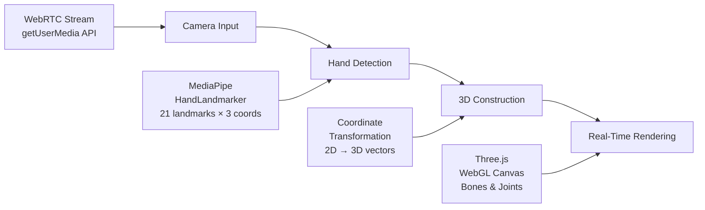
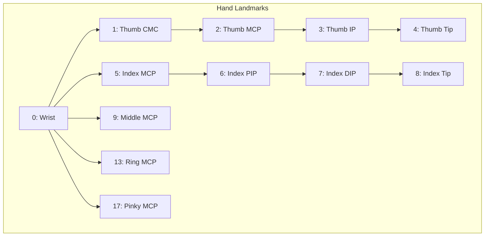
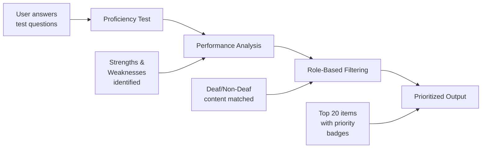
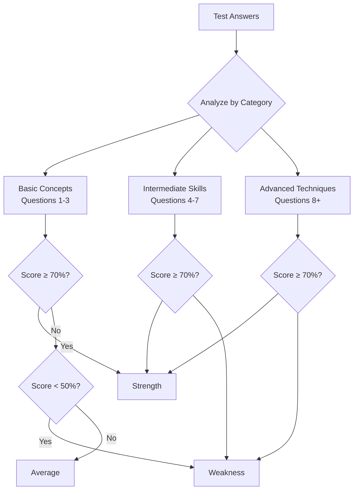
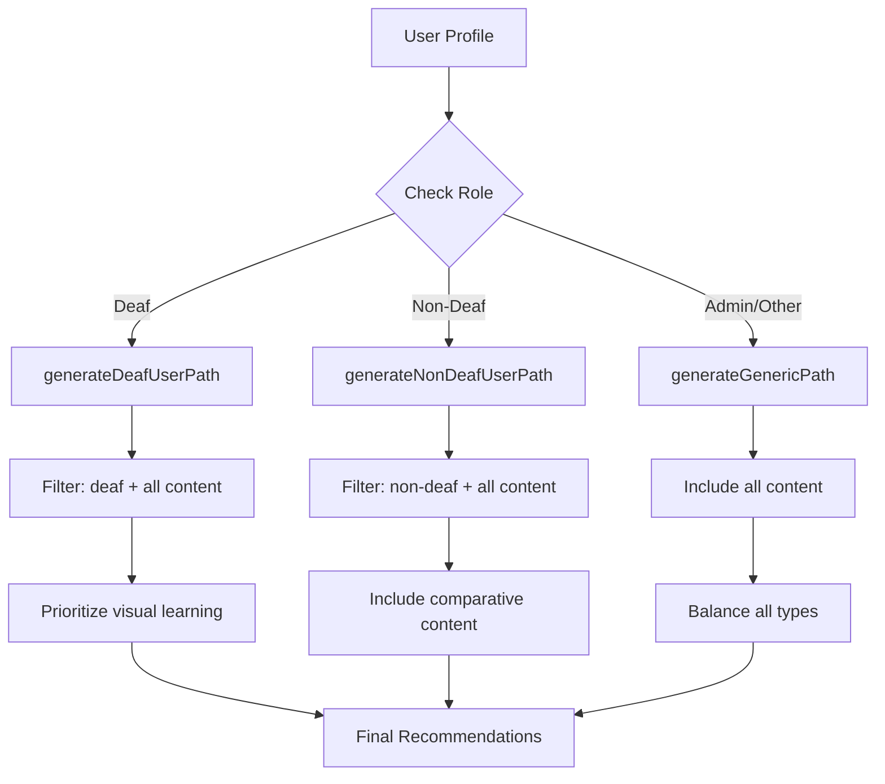
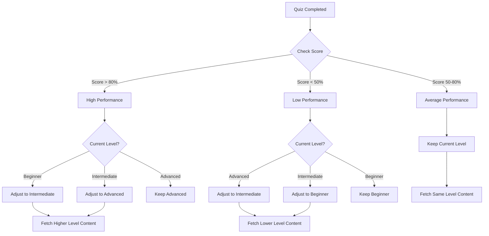

# 5.2 System Complexity - SignBridge

This section describes the technical complexity of two key modules in the SignBridge application: 3D Avatar Visualization and Dynamic Learning Path.

---

## 5.2.2 3D Avatar Visualization

The 3D Avatar Visualization module enables users to contribute sign language gestures through real-time hand tracking and three-dimensional rendering. This feature captures hand movements using computer vision, transforms them into skeletal representations, and stores them as reusable gesture data for the sign language dictionary. By converting video input into privacy-preserving landmark data, the system allows gesture contribution without storing actual images or videos of users, addressing privacy concerns while building a comprehensive gesture database.

The module is designed as a real-time processing pipeline that integrates browser-based camera access, machine learning-powered hand detection, coordinate transformation, and WebGL 3D rendering. The workflow operates continuously during gesture capture, processing video frames at 30-60 frames per second to provide immediate visual feedback.

### System Architecture

The 3D Avatar system follows a four-stage pipeline architecture:

**Figure 5.2.2.1:** System architecture showing the data flow from camera input to 3D rendering.

### Phase 1: Camera Input and Video Stream

The first phase establishes a real-time video stream from the user's webcam using the WebRTC getUserMedia API. The browser requests camera access permission, and upon approval, creates a continuous video stream that feeds into the hand detection module. The video element is configured with specific attributes (autoPlay, playsInline, muted) to ensure compatibility across different browsers and devices, particularly mobile platforms where inline playback is required.

The camera stream operates at the device's native frame rate, typically 30 FPS on standard webcams and up to 60 FPS on higher-end devices. Each frame is passed to the hand detection module for landmark extraction, creating a continuous flow of hand position data.

### Phase 2: Hand Detection with MediaPipe

The hand detection phase employs Google's MediaPipe HandLandmarker, a pre-trained machine learning model optimized for real-time hand tracking. For every video frame processed, the model detects up to two hands and extracts 21 landmark points per hand. Each landmark represents a specific anatomical point on the hand, from the wrist (landmark 0) through each finger joint to the fingertips (landmarks 4, 8, 12, 16, and 20).

**Figure 5.2.2.2:** MediaPipe 21 hand landmark structure showing key joint positions.

Each landmark is represented by three normalized coordinates (x, y, z), where x and y represent the position within the video frame (0 to 1), and z represents the depth relative to the wrist. This results in a 63-dimensional feature vector per hand (21 landmarks × 3 coordinates).

The system implements a graceful degradation strategy for browser compatibility. Upon initialization, the module first attempts to use GPU acceleration through WebGL for faster processing. If GPU initialization fails due to browser restrictions or hardware limitations, the system automatically falls back to CPU-based processing, ensuring functionality across Chrome, Firefox, Edge, and Safari with varying WebGL support levels.

### Phase 3: 3D Coordinate Transformation

The coordinate transformation phase converts the normalized MediaPipe landmarks into three-dimensional world coordinates suitable for WebGL rendering. This transformation involves three key operations:

First, the x and y coordinates are centered by subtracting 0.5 (shifting the origin from the corner to the center) and scaled by a factor of 4 to create appropriate visual proportions. Second, the y-axis is inverted to match the Three.js coordinate system where positive y points upward. Third, the z-coordinate is amplified by a factor of 10 to make depth variations visible when the user rotates the 3D view, as raw MediaPipe z-values are relatively small.

The transformation preserves the spatial relationships between landmarks while creating a visually meaningful 3D representation that users can rotate and examine from different angles.

### Phase 4: Real-Time 3D Rendering

The final phase renders the transformed landmarks as a 3D skeletal hand model using React Three Fiber, a React wrapper for the Three.js WebGL library. The hand model consists of two geometric primitives: cylindrical bones connecting adjacent landmarks, and spherical joints at each landmark position.

The rendering system defines 20 bone segments that connect the landmarks according to hand anatomy. Five segments form each finger (connecting the four joints from base to tip), and four additional segments connect the wrist to each finger's base. The palm is rendered with three additional bone segments connecting adjacent finger bases.

Visual differentiation between left and right hands is achieved through distinct color schemes. Left hands are rendered in blue tones (#a8d4ff for bones, #6bb3ff for joints), while right hands use orange tones (#ffc0a8 for bones, #ffb3a0 for joints). This color coding helps users understand hand orientation during gesture capture.

The Canvas component configures the WebGL renderer with antialiasing enabled for smooth edges, a 50-degree field of view camera positioned 3 units from the origin, and a three-point lighting setup (ambient, directional, and point lights) for realistic depth perception.

**Figure 5.2.2.3:** Screenshot of the 3D avatar visualization showing real-time hand tracking with bone and joint rendering. *(Insert screenshot from `/avatar/generate` page)*

### Recording and Playback System

Beyond real-time visualization, the module includes a recording system that captures frame-by-frame landmark data for gesture storage. When the user initiates recording, the system begins storing timestamped snapshots of all detected hand landmarks. Each recording captures the complete temporal sequence of hand movements, enabling accurate gesture playback without storing any video data.

The recording data structure includes an array of frames (each containing a timestamp and landmark positions for all detected hands), the total duration in milliseconds, and the frame count. This compact representation typically requires only a few kilobytes per gesture, compared to megabytes for equivalent video storage.

**Figure 5.2.2.4:** Screenshot of the gesture preview and save form, showing the complete user workflow for avatar contribution. *(Insert screenshot showing preview panel and save form)*

### Key Technical Strengths

The 3D Avatar Visualization module demonstrates several technical strengths that contribute to its effectiveness:

**Privacy-Preserving Design:** By storing only skeletal landmark coordinates rather than images or videos, the system protects user privacy while still capturing the essential information needed for gesture recognition and playback.

**Cross-Browser Compatibility:** The automatic GPU/CPU fallback mechanism ensures the feature works across different browsers and devices, maximizing accessibility for users regardless of their hardware capabilities.

**Real-Time Performance:** Leveraging WebGL acceleration and optimized rendering techniques, the system maintains smooth 30-60 FPS performance, providing immediate visual feedback that is essential for accurate gesture capture.

**Dual-Hand Support:** The ability to track and render two hands simultaneously enables capture of two-handed signs, which are common in both ASL and MSL.

---

## 5.2.3 Dynamic Learning Path Module

The Dynamic Learning Path module provides personalized learning recommendations based on individual user performance, proficiency level, and user role (deaf or non-deaf). This feature analyzes proficiency test results to identify strengths and weaknesses, then generates a prioritized curriculum that adapts as users progress through the learning content. By tailoring the learning experience to each user's needs, the system maximizes learning efficiency and maintains user engagement.

The recommendation system is designed as a multi-factor scoring engine that combines performance analysis, role-based content filtering, and adaptive level adjustment. The workflow is divided into initial assessment (proficiency testing) and continuous adaptation (learning path updates based on ongoing performance).

### System Architecture

The learning path generation follows a four-stage pipeline:

**Figure 5.2.3.1:** System architecture showing the learning path generation pipeline from test completion to recommendation output.

### Phase 1: Proficiency Assessment

The learning path generation begins with a proficiency test that evaluates the user's current knowledge of sign language. Users select either an ASL (American Sign Language) or MSL (Malaysian Sign Language) test, then answer a series of multiple-choice questions covering various aspects of sign language knowledge.

Upon test completion, the system calculates an overall score and assigns a proficiency level based on performance thresholds. Users scoring below 50% are classified as Beginner, those scoring between 50% and 80% as Intermediate, and those above 80% as Advanced. This initial classification serves as the baseline for content recommendations.

The test attempt and all individual answers are stored in the database, enabling detailed performance analysis in the subsequent phase.

### Phase 2: Performance Analysis Engine

The performance analysis phase examines the user's test responses to identify specific areas of strength and weakness. Rather than treating all questions equally, the system groups questions into three difficulty categories based on their position in the test sequence:

| Category | Question Range | Description |
|----------|---------------|-------------|
| Basic Concepts | Questions 1-3 | Fundamental vocabulary and simple signs |
| Intermediate Skills | Questions 4-7 | Sentence structure and common phrases |
| Advanced Techniques | Questions 8+ | Complex expressions and nuanced meanings |

For each category, the system calculates the percentage of correct answers. Categories where the user scores 70% or higher are identified as strengths, while categories below 50% are flagged as weaknesses. This granular analysis enables targeted recommendations that address specific knowledge gaps rather than generic suggestions.

The analysis also generates personalized insights based on performance patterns. For example, if a user excels in Basic Concepts but struggles with Advanced Techniques, the system might note: "You have a strong foundation in basic signs. Focus on advanced expressions to reach the next level."

**Figure 5.2.3.2:** Performance analysis flowchart showing how test results are categorized into strengths and weaknesses.

**Figure 5.2.3.3:** Screenshot of the proficiency test results page showing performance breakdown by category with percentage bars. *(Insert screenshot from `/proficiency-test/results` page)*

### Phase 3: Role-Based Content Filtering

The third phase tailors content recommendations based on the user's role, recognizing that deaf and non-deaf learners have different needs and learning preferences.

For deaf users, the system prioritizes visual learning materials and sign language-first content. These users typically learn sign language as a primary or native language, so recommendations emphasize advanced vocabulary, regional variations, and deaf community cultural content. The recommendation reasons reflect this focus, such as "Visual learning to strengthen Basic Concepts."

For non-deaf users (hearing learners), the system includes comparative content that bridges sign language with spoken language. These users benefit from explanations that connect signs to their spoken equivalents, pronunciation guides for fingerspelling, and context about when and how to use specific signs. Recommendation reasons might include "Comparative learning with spoken language context."

Content in the database is tagged with a `recommended_for_role` field that can be "deaf", "non-deaf", or "all". During filtering, the system prioritizes role-specific content while still including universal content that benefits all learners.

**Figure 5.2.3.4:** Role-based filtering flowchart showing how content is selected based on user type.

### Phase 4: Priority Scoring and Output

The final phase assigns priority scores to each recommendation and produces a sorted list of learning items. The priority system uses three levels:

| Priority | Badge Color | Meaning | Typical Content |
|----------|-------------|---------|-----------------|
| Priority 1 | Red | Urgent - addresses weak areas | Tutorials for weakness categories |
| Priority 2 | Yellow | Practice - reinforce learning | Quizzes for current level |
| Priority 3 | Blue | Reference - supplementary | Materials for self-study |

Content that directly addresses identified weaknesses receives Priority 1, ensuring users focus first on areas needing improvement. Practice content (quizzes) that reinforces learning receives Priority 2, while reference materials for independent study receive Priority 3.

Within each priority level, role-specific content is ranked higher than universal content. For example, a deaf user would see deaf-specific tutorials before universal tutorials, even if both address the same weakness.

The system outputs the top 20 recommendations, each including the content type (tutorial, quiz, or material), title, description, assigned priority, and a human-readable reason explaining why this item was recommended. This transparency helps users understand their learning path and builds trust in the recommendation system.

**Figure 5.2.3.5:** Screenshot of the Learning Path Panel on the dashboard showing prioritized recommendations with color-coded badges. *(Insert screenshot from `/dashboard` showing Learning Path Panel)*

### Adaptive Level Adjustment

Beyond the initial proficiency assessment, the learning path continuously adapts based on ongoing user performance. When a user completes a quiz, the system evaluates their score and may adjust the difficulty level of future recommendations.

The adaptive logic follows these rules:

**Figure 5.2.3.6:** Adaptive level adjustment flowchart showing how quiz performance affects content difficulty.

This adaptive mechanism ensures users are consistently challenged at an appropriate level. High performers are pushed toward more advanced content to maintain engagement, while struggling users receive foundational content to build confidence before progressing.

### Real-Time Path Updates

The learning path is not static; it updates automatically when users complete learning activities. After finishing a tutorial, the system re-evaluates recommendations to potentially suggest the next tutorial in a sequence or shift focus to a different weakness area. After completing a quiz, the adaptive level adjustment is triggered, potentially changing the difficulty of all subsequent recommendations.

Users are notified of path updates through a "New" badge that appears on the Learning Path Panel when recommendations have changed. This visual indicator encourages users to check their updated path and maintains engagement with the learning system.

**Figure 5.2.3.7:** Screenshot showing the "New" badge indicator when recommendations are updated after quiz completion. *(Insert screenshot showing the green "New" badge)*

### Key Technical Strengths

The Dynamic Learning Path module demonstrates several technical strengths:

**Multi-Factor Personalization:** By combining proficiency level, performance analysis, and user role, the system creates truly individualized learning paths rather than one-size-fits-all recommendations.

**Transparent Reasoning:** Each recommendation includes an explanation of why it was suggested, helping users understand and trust the system's guidance.

**Continuous Adaptation:** The learning path evolves based on ongoing performance, ensuring recommendations remain relevant as users progress.

**Inclusive Design:** Role-based filtering ensures both deaf and non-deaf users receive appropriate content that matches their learning context and needs.

**Scalable Architecture:** The modular design allows easy addition of new scoring factors (such as time-based recommendations or social learning features) without restructuring the existing system.

---

## Summary

Both modules demonstrate significant technical complexity while maintaining user-centric design:

| Aspect | 3D Avatar Visualization | Dynamic Learning Path |
|--------|------------------------|----------------------|
| **Core Technology** | MediaPipe ML + Three.js WebGL | Multi-factor scoring algorithm |
| **Data Processing** | Real-time video → 3D coordinates | Test results → recommendations |
| **Adaptability** | GPU/CPU fallback for compatibility | Level adjustment by performance |
| **Personalization** | Dual-hand tracking with color coding | Role-based content filtering |
| **Privacy/Trust** | Landmark-only storage (no video) | Transparent recommendation reasons |
| **Output** | Interactive 3D hand visualization | Prioritized learning curriculum |

The technical sophistication of these modules, combined with their focus on accessibility and user experience, ensures SignBridge provides an effective and engaging platform for sign language learning and contribution.
